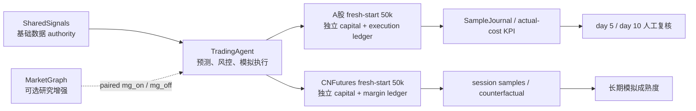

# TradingAgent

TradingAgent 是候选研判、风险控制、模拟执行、样本记录和复盘系统。当前目标是在真实数据、费用、滑点和小账户约束下形成可学习闭环，逐步检验是否存在费用后正期望；这不是收益承诺。

> 接手顺序：[AGENTS.md](AGENTS.md) → [STATUS.md](STATUS.md) → [docs/AGENTS.md](docs/AGENTS.md)。

## 当前架构



- SharedSignals 提供统一只读数据；TradingAgent 不直读兄弟仓数据库，也不现场采集行情。
- MarketGraph 只作可开关增强，不阻塞基础样本闭环，也没有资金或执行权。
- A股和 CNFutures 各自拥有独立的 50,000 CNY 模拟账户；两个账户不得相加、净额抵消或互相补资。
- 所有流程保持 `REAL_TRADING_ENABLED=false`。邮件、同花顺人工实盘和 broker gateway 都未在本仓实现。

## 资本与风险

| 市场 | 初始权益 | 主要容量 | 独立风险状态 |
|---|---:|---|---|
| A股 | 50,000 CNY | 股票总敞口 90%；单票 15%；100 股整手；最多 8 个仓位并支持至少 7 个不同股票 | 5% 回撤收紧，7% 暂停 |
| CNFutures | 50,000 CNY | 保证金使用率 50%；最小一手与止损损失预算另行校验 | 5% 回撤收紧，7% 暂停 |

A股不设固定保护现金：全部资金可服务合格机会，但弱市、无正期望或硬门禁未过时不强制部署。资金计划必须展示利用率和未部署原因；现金管理收益与股票 alpha 分账。

历史共享资金池、旧模拟持仓/PnL 和旧多账本均冻结只读，不进入新 authority、KPI、成熟度或前端汇总。

## 样本闭环

- `observation/counterfactual`：所有数据合格候选保存多风格预测和前向标签请求，不被成熟策略阈值阻断。
- `exploration`：在硬风控内从安全 top-K 做分层随机/epsilon-greedy，记录 propensity；每日最多新增一个、累计探索敞口不超过 7,500 CNY。
- `exploitation`：按成熟策略门槛运行，与 exploration 分开统计。
- A股四类假设共享一个执行账户，同一股票同日最多一份真实规格模拟订单；未选风格仍生成标签。
- CNFutures 每个有效会话记录 prediction/candidate/hold/reject/fill；一手不适配时保留 `counterfactual_only`，不伪造成交。
- 标签固定为 `m30/m60/close/1d/3d/5d`。真实成交使用实际费用/滑点，反事实使用版本化保守成本。

SampleJournal/KPI 是唯一演化 authority。旧 review 结果不能自动晋级、扩风险或切实盘。

## 运行入口

先固定模拟边界：

```bash
export REAL_TRADING_ENABLED=false
```

只读检查：

```bash
python3 tools/market_capital_ops.py dual-status --trade-date YYYYMMDD
python3 -m shared.runtime_test.full_acceptance --profile quick --pretty
python3 -m shared.runtime_test.full_acceptance --profile prod --pretty
```

资本、样本和会话完整验收需要显式传入两个 capital root、A股 journal、label 截止时间、期货记录和有效会话；见 [docs/operations.md](docs/operations.md)。缺证据必须失败或明确 warning，不能用“样本不足”静默通过。

## 文档入口

- [系统架构](docs/architecture.md)
- [数据与事实契约](docs/data_contract.md)
- [样本与成熟度验收](docs/capital_growth_validation.md)
- [运行、验收与回滚](docs/operations.md)
- [冻结范围后的 Backlog](docs/BACKLOG.md)
- [当前状态](STATUS.md)

本地通过、远端主线、生产文件、生产 runtime、cron 生效和真实市场样本是不同层级；任何一层都不能替代其它层。当前工作禁止 push、deploy、apply cron、发邮件或真实交易。
