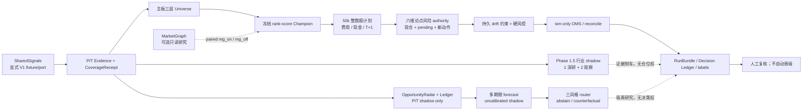

# TradingAgent

TradingAgent 是候选研判、风险控制、模拟执行、样本记录和复盘系统。当前目标是在真实数据、费用、滑点和小账户约束下形成可学习闭环，逐步检验是否存在费用后正期望；这不是收益承诺。

> 接手顺序：[AGENTS.md](AGENTS.md) → [STATUS.md](STATUS.md) → [docs/AGENTS.md](docs/AGENTS.md)。

## 当前开发状态（2026-07-16）

当前 `codex/ta-v1-data-client` 是**已完成本地验收、仅允许提交/推送到隔离分支的候选**。候选已包含 SS V1 严格客户端、内容寻址 `CoverageReceipt`、三层 Universe、Phase 1.5 行业 shadow 薄切片、PIT OpportunityRadar/append-only Ledger、多期限 forecast 研究合同、三风格 shadow router、50,000 CNY 小资金可行池与账户证明绑定合同、六维投资论点风险 authority、A股零股卖出规则、当前选择与数值 PIT 特征双重绑定的冻结 rank-score Champion、mark/quote 证据 authority、逐副作用可信时钟、持久 drift 约束、模拟日 RunBundle、Decision Ledger、外部冻结交易日历 proof/`ValidationPlan`/冻结OOS/总回报标签门、负向模型保护，以及带本地CAS journal的 LLM 证据 sidecar。但这不表示预测有效、概率已校准、Phase 1、Git 主线、SharedSignals live API、生产 runtime、已安装 scheduler/cron 或真实模拟盘已完成。

当前固定范围：

- 个股研究、候选、预测、影子账、模拟订单和持仓仅允许沪深主板普通 A 股；
- 创业板、科创板指数和全市场行业聚合可作市场环境参考，双创个股不进入任何个股交易链；
- 系统仅供 Nicholas 个人内部使用；看板/API默认只监听localhost，`tradingagent.cc`只作为经过Cloudflare Access或等价单用户认证的个人远程入口，禁止匿名公网访问和API直出；
- TA 只按显式配置消费 `GET /v1/catalog` 和 `POST /v1/query`，禁止回退 Tushare、SS SQLite、旧专用端点或缓存拼装；当前仅使用 fixture/port，不臆造 SS runtime 已可用；
- 自动模拟盘有两条严格分开的本地候选：仓外 fixture CLI 可执行但使用不可晋级的 fixture account/proof；`compose_capital_backed_paper_runtime` 从 canonical simulated ledger 读取 current generation/lineage，并贯穿 Champion、六维论点风险 authority、mark/quote authority、逐副作用可信时钟、risk、capital outbox、模拟成交和reconcile。崩溃恢复只会优先补写已经由canonical ledger证明为幂等已提交的outbox settlement；只有pending intent而没有对应commit事实时，最新risk/drift门仍可阻止新增风险。目前该composition只有测试装配，没有 CLI、scheduler、生产行情/时钟/论点风险 verifier 或真实 paper session。自动模型晋级、恢复风险、扩风险和 live transition 永久不由学习环自行授权；
- 第一阶段只有一个冻结的未校准 rank-score Champion；score receipt 必须同时绑定当前人工选择 manifest、artifact/model/spec 和经独立 port 复核的数值 PIT 特征快照，rank 只排序且不控制仓位。`OpportunityRadar`/Ledger、多期限 forecast 和三风格 router 已实现本地隔离 shadow 合同，只能写反事实研究证据；真实 DeepSeek transport 和 live paper scheduler 仍为 `PLANNED_NOT_IMPLEMENTED`；
- Phase 1.5 行业薄切片只根据 PIT taxonomy、覆盖与证据动态选择 1 个深研行业和 2 个观察行业；它不输出个股、不改变排名/仓位/风险/订单，也不证明所选行业有 alpha；
- 仓库中保留的旧 A股 wrapper/cron 名称只供迁移审计，入口已统一硬阻断且不能用环境变量恢复；新 day loop 尚未注册或应用 scheduler；
- LLM产品角色`flash_extract`/`pro_thinking`分别映射代码路由`bulk_extraction`/`slow_research`，只做固定Prompt、内容寻址证据抽取和研究复核；source span 作为不可信引用数据处理，显式中英文提示注入模式会在transport前阻断并要求人工复核。2026-07-16已从DeepSeek官方公开文档核对OpenAI格式base URL、V4 Flash/Pro模型ID、JSON与thinking能力；这只证明公开接口目标，不证明当前账户的认证`/models` readback、额度、限流、字段响应或真实可用性。默认Gateway通过严格、无密钥配置构造；当前adapter只接受同时绑定request/outbound hash的`OfflineDeepSeekFixtureTransport`，任意普通callable在调用前拒绝，因此不存在真实网络路径。成功的离线证据可写入带CAS、hash-chain和本地`.head`锚点的shadow journal；它只能发现本地不一致，不是外部密封或tamper-proof生产authority。vendor model ID不进入领域合同，也不参与个股排名、仓位、风险、订单或账户操作。

- DeepSeek密钥变量名固定为`DEEPSEEK_API_KEY`且配置对象不读取其值；任意模型映射只能通过显式`fixture_only`离线路由构造，不能授权provider egress。独立的宽松环境变量路由入口和旧wrapper中的DeepSeek超时/重试假配置均已移除，避免把尚不存在的网络能力误读成已实现。

### 数据 ownership 与迁移分类

- SharedSignals 是独立上游数据平台；本仓只实现和验证 TA consumer。TA 测试不得定位、导入、执行或复刻兄弟仓 `reader.py`、`api_server.py`、SQLite 私有函数或 HTTP server。
- **current-v1**：`shared/data/sharedsignals_v1.py`、Evidence Gate、immutable research snapshot、stage ports 和只读前端 SS market-context reader；只允许 `/v1/catalog` 与 `/v1/query`。
- **active-compatibility**：旧 `shared/data/reader.py`、screening/benchmark 和非 A 股消费者仍有明确历史/兼容用途，但不在 A股 V1 candidate、Champion、scheduler、风险或订单路径。
- **hard-blocked / retirement-pending**：旧 A股 wrappers/cron、旧机会漏斗writer与专用 SS 路由不得恢复；旧漏斗文件只作冻结法证历史，未经V1 authority绑定的A股 `signals/pending` 不进入当前前端状态。物理删除要等消费者、安装态、同 `as_of` parity、OpportunityLedger只读投影和外部依赖清零，不能用长期双轨代替退役。

最新验证层级、旧路径残留和阻塞必须回到 [STATUS.md](STATUS.md)，不得从模块存在或单个测试通过推断整条链已完成。

## 当前架构



- SharedSignals 提供统一只读数据；TradingAgent 不直读兄弟仓数据库，也不现场采集行情。
- MarketGraph 只作可开关增强，不阻塞基础样本闭环，也没有资金或执行权。
- A股和 CNFutures 各自拥有独立的 50,000 CNY 模拟账户；两个账户不得相加、净额抵消或互相补资。
- 所有流程保持 `REAL_TRADING_ENABLED=false`。邮件、同花顺人工实盘和 broker gateway 都未在本仓实现。

## 资本与风险

| 市场 | 初始权益 | 主要容量 | 独立风险状态 |
|---|---:|---|---|
| A股 | 50,000 CNY | 股票总敞口90%；单票15%；买入100股整数倍，卖出含完整零股/全退例外；最多8仓并支持至少7个不同股票 | 5% 回撤收紧，7% 暂停 |
| CNFutures | 50,000 CNY | 保证金使用率 50%；最小一手与止损损失预算另行校验 | 5% 回撤收紧，7% 暂停 |

A股不设固定保护现金：全部资金可服务合格机会，但弱市、没有通过冻结rank/成本/风险门禁的合格候选，或硬门禁未过时不强制部署。当前rank score尚不能证明正期望；资金计划必须展示利用率和未部署原因，现金管理收益与股票 alpha 分账。

历史共享资金池、旧模拟持仓/PnL 和旧多账本均冻结只读，不进入新 authority、KPI、成熟度或前端汇总。

## 第一阶段闭环与科学门禁

- V1 只对主板候选运行冻结 rank score，并把 `PAPER_FILLED / PAPER_NOT_FILLED / REJECTED / OBSERVATION_ONLY` 全部写入可追溯决策账本；同一股票同日最多一份 authority-bound 模拟订单。机会、forecast和三风格shadow各有独立content-addressed receipt，不能进入这条订单链。
- 50k optimizer 从唯一 A股 policy 读取15%单票、90% gross、最多8只、最低经济订单、无交易区、费用和现金约束；完整账户快照必须经无默认verifier返回的detached proof做内容、身份、时点与有效期绑定复核。fixture路径只证明“输入与proof一致”；canonical-capital测试路径则从同一模拟ledger head派生并复读账户快照，generation/lineage轮换也必须随current snapshot，而不是写死。两者都不证明真实broker账户。买入只允许100股整数倍；卖出只允许100股整数倍、完整零股余额或全部退出，且受T+1可卖量约束。估值价与下单预留价分开，未部署现金必须有reason code。
- `ThesisRiskRuntimeAuthority` 对行业、投资论点、原材料、政策/事件、拥挤和模型家族六个维度使用显式人工复核上限，并以 detached policy proof、逐成员 exposure proof 和完整 exposure-set receipt 绑定当前持仓、所有 open/increase pending 预约与候选；pending 卖出不会重复计入风险。同一symbol的candidate/position/pending不能改换group，day loop会把重签plan逐项绑定回权威receipt；外层非晋级状态也不能掩盖嵌套proof为可晋级。运行时不能自签、补默认权威或在下一决策把既有风险重置为零。只有新增/增加风险会因超限被拒绝，经过验证的减仓/退出仍可继续。当前 policy/verifier 仅为不可晋级 fixture，不证明生产行业映射、真实 pending book 或适合实盘的上限数值。
- 非空持仓 mark 与可执行订单 quote 都必须携带不可变 `MarketEvidenceAuthority`，逐项绑定 dataset/catalog、source receipt/hash、lineage、calendar receipt、capital generation、execution lineage 和决策/执行时点。当前唯一具体实现是不可继承、`production_eligible=false` 的 fixture verifier；其hash只证明本地内容绑定，不是签名、交易所行情或 SharedSignals live readback。
- `ValidationPlan` 已把标签期限、最大特征回看、purge/embargo、事件簇隔离、试验预算、PBO/DSR、冻结 OOS receipt，以及独立复核且冻结于预测前的 A股交易会话 calendar proof 纳入不可变合同。SampleJournal 和 A股 label/sample ops 调用链都必须显式传入该计划；两个 CLI 只通过 `--validation-plan-path` 加载预先生成、内容寻址的 `ashare_validation_plan_v1` artifact，不在运行时调用verifier或自签proof。A股 `close/1d/3d/5d` target 必须来自同一会话证明，调用方只能断言同一时点，不能顺延缺失日线。这仍只是本地合同与fixture verifier，真实上游 calendar authority、artifact registry、walk-forward、PBO 和 DSR 实证均未完成。
- metrics v2 数值产物不能自报 lineage；本地 verifier 固定 implementation trust root，重读 canonical artifact 与完整 detached receipt，并复核 label/cost/source、窗口/horizon/regime、journal/model 和独立样本数。该 proof 仍只是本地完整性绑定，不是数字签名或外部独立重算 authority。持久 drift latch 会在每次风险评估及网络关闭的模拟副作用前重读，capital commit还在时钟校验后做最终authority重读；模拟提交和资本提交分别从显式 `TrustedExecutionClock` 获取不截断时点并再次验证 quote，强制`quote <= submit <= fill/terminal <= commit <= reconcile`。TOCTOU或坏时钟时释放预约且不提交账务，日循环与对账复用严格零成交失败合同。它阻断 open/increase、保留已验证 reduce/exit，并把无新增订单日明确结束为 `completed_with_blocks`；健康重启不会自动清除 latch。未来真实broker/scheduler仍须接入生产时钟、市场证据、原子化authority+commit和独立metrics authority。
- 可执行自动闭环只在网络关闭的冻结 fixture 中得到验证；相同输入的业务 bundle 已验证不受本机输出根绝对路径影响，同根 replay 不重放 transport。另有 canonical-capital composition 的测试候选证明单一模拟账本、人工选择Champion、动态generation/lineage、capital outbox与reconcile可组合，但它还没有 CLI/scheduler/live sample。真实 SS V1、市场日历 scheduler 和 20 个交易日运行尚未验收。旧四风格、exploration/exploitation 路径仍是 time-boxed legacy，不是 V1 当前路由。
- CNFutures 维持独立旧契约和独立 50k authority；A股重构不能隐式改变其行为。

SampleJournal/KPI 仍是正式演化 authority。Decision Ledger、fixture、paper、shadow 和 LLM evidence 都不能自行晋级、扩风险或切实盘。

## 初始行业研究池与小资金适配

第一阶段不把“今年活跃行业”硬编码成长期股票池。行业篮子只能由带有效期、score/coverage receipts 和独立 verifier 的 `IndustryActivityScore` 动态选出；真实 authority 尚未接入时就不发布当期深研行业。为建设 ontology、数据字段和事件模板，可先用以下**研究假设标签**做 fixture/覆盖设计，它们不是当期排名或买入清单：

| 研究假设标签 | 首批应验证的机制 | 当前权限边界 |
|---|---|---|
| AI 算力—半导体—存储—数据中心基础设施 | 海外资本开支、存储/设备周期、订单与盈利兑现、拥挤和已定价程度 | 只映射具备可核验主营暴露的沪深主板普通股；双创个股排除 |
| 机器人—工业自动化—核心零部件 | 样机→订单→交付→客户验收→现金流的事件生命周期 | 同上；概念标签不能替代收入/客户/产能证据 |
| 创新药—临床—海外授权 | 试验/审批 hazard、授权条款、上市公司权益和失败尾部 | 第一阶段优先 shadow 研究；没有结构化临床/监管 authority 不进入 Champion |
| 商业航天、有色/能源/电网 | 计划事件、供需/商品/外部冲击与公司暴露 | 观察池候选；必须由动态评分决定，不能固定占用名额 |

是否适合 50,000 CNY 不是行业属性，更不是“小市值股票”标签，而是逐证券可执行性。至少要求一手预留金额加保守费用不超过 7,500 CNY 单票上限（因此未计缓冲前股价通常也需低于约 75 CNY）、有效订单达到 2,000 CNY 最低经济金额、流动性和 T+1/涨跌停风险可重放，并且不会形成同一产业论点集中。无法满足时现金胜出；在真实 SS V1 `as_of` 筛选完成前，本规划不列固定股票代码。

## 分阶段目标

| 阶段 | 范围 | 出口证据 |
|---|---|---|
| Phase 0 | V1 合同、主板 scope、CoverageReceipt、50k policy、rank Champion | 契约/故障负例与全量本地验收 |
| Phase 1 | 真实 SS V1 驱动的自动模拟日闭环 | 连续 20 个交易日无未来数据、重复订单、权限泄漏、旧链 fallback 和未解释账务差异 |
| Phase 1.5 | 1 个深研行业 + 2 个观察行业的 shadow 研究 | PIT 覆盖、证据与反事实增量；不影响 Champion |
| Phase 2 | 将现有多期限shadow合同升级为有统计证据的 Challenger | purged walk-forward、冻结 OOS、PBO/DSR、quantile/calibration与删失处理证据；合同存在不算通过 |
| Phase 3 | 将现有三风格shadow合同升级为统一 50k 候选路由 | 分组消融、独立收益来源、费用后增量、abstain价值、尾部与相关性稳定；仍不自动晋级 |
| Phase 4 | 人工批准的受控试运行设计 | 另行授权；不由本候选推导 |

## 运行入口

先固定模拟边界：

```bash
export REAL_TRADING_ENABLED=false
```

只读检查：

```bash
python3 tools/market_capital_ops.py dual-status --trade-date YYYYMMDD
python3 -m shared.runtime_test.full_acceptance --profile quick --pretty
python3 -m shared.runtime_test.full_acceptance --profile prod --pretty
```

资本、样本和会话完整验收需要显式传入两个 capital root、A股 journal、label 截止时间、期货记录和有效会话；见 [docs/operations.md](docs/operations.md)。缺证据必须失败或明确 warning，不能用“样本不足”静默通过。

## 文档入口

- [系统架构](docs/architecture.md)
- [数据与事实契约](docs/data_contract.md)
- [系统状态语义](docs/system_state_matrix.md)
- [A股 Universe 范围契约](docs/universe_contract.md)
- [样本与成熟度验收](docs/capital_growth_validation.md)
- [运行、验收与回滚](docs/operations.md)
- [冻结范围后的 Backlog](docs/BACKLOG.md)
- [当前状态](STATUS.md)

本地通过、候选远端分支、远端主线、生产文件、生产 runtime、cron 生效和真实市场样本是不同层级；任何一层都不能替代其它层。本次发布授权只允许把已验证候选提交并推送到隔离分支；merge/main、deploy、apply cron、生产密钥、发邮件或真实交易仍需各自通过独立门禁。
