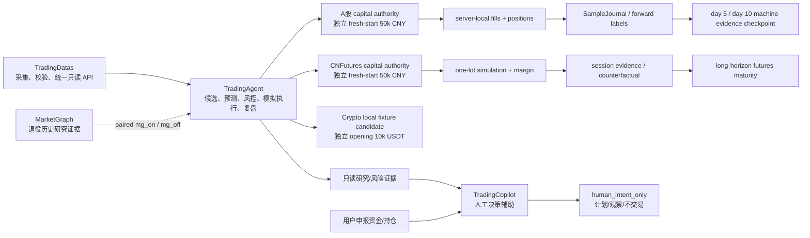
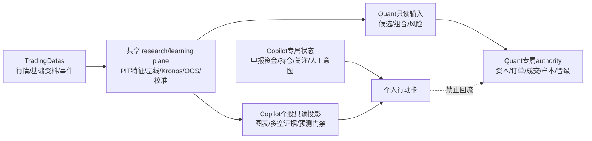
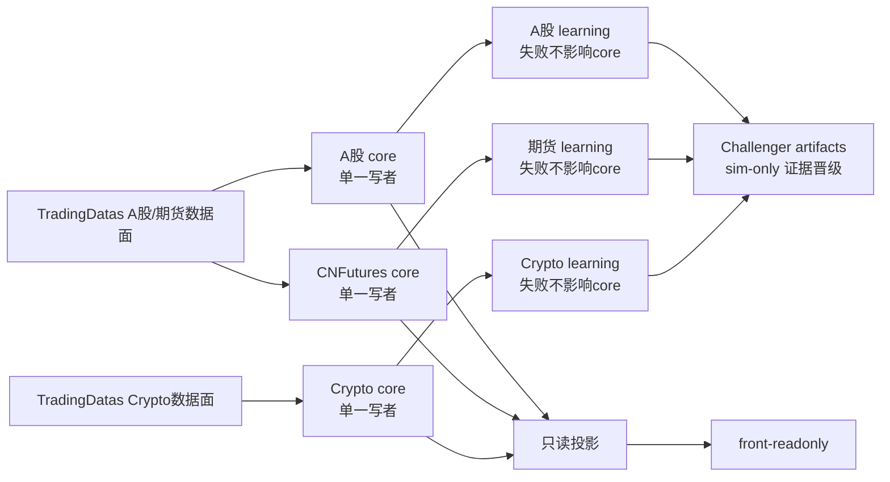
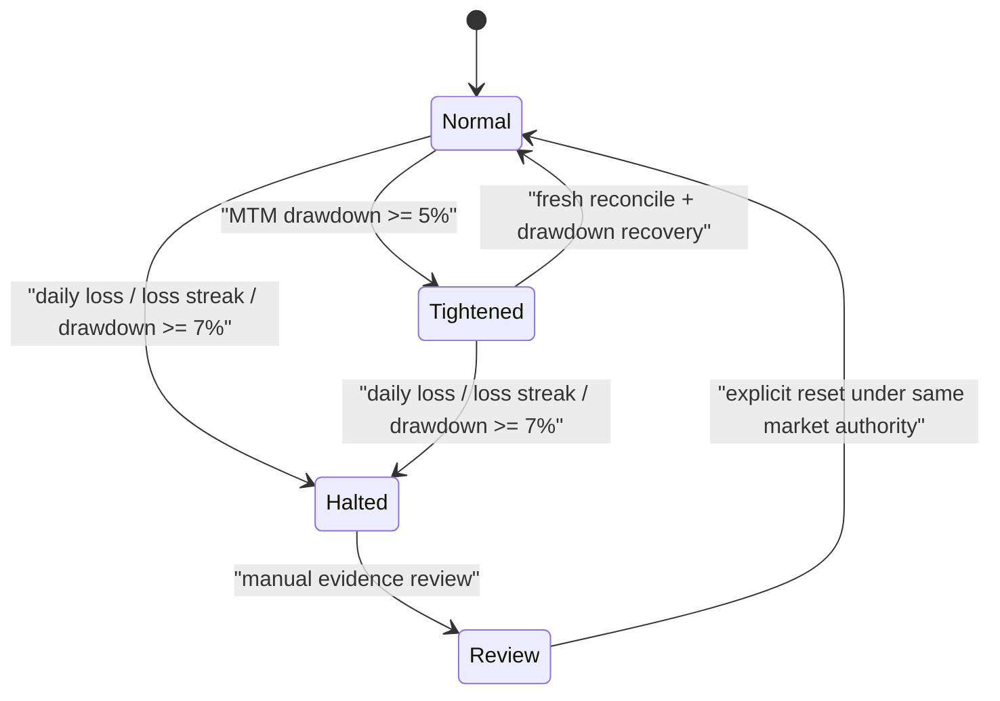
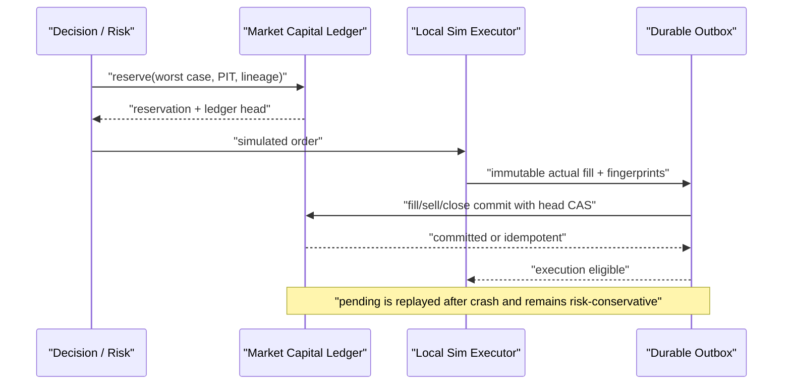

# TradingAgent 架构

> 本文定义长期系统边界与当前 capital-growth 架构。当前完成度以本轮新鲜运行读回及其回执为准；[STATUS.md](../STATUS.md) 是历史快照。字段见 [data_contract.md](data_contract.md)，运行和回滚见 [operations.md](operations.md)。

## 目标与非目标

TradingAgent 的短期目标是在 A股与 Crypto 各自独立的市场 lane 中形成“数据 → 预测 → 风控 → 市场规则约束下的模拟成交/拒绝 → 前向标签 → 费用后复盘”的可学习闭环，分别用真实证据判断策略是否存在可重复正期望。CNFutures 当前暂停，其既有合同与证据只读保留，不据此启动新开发或运行。

仓库同时提供 A 股 `TradingCopilot` 人工决策面。它读取 Quant Core 已验证的只读观察，结合用户申报账户形成行动卡；没有正式覆盖时必须显示 `analysis_unavailable`。它的资金、持仓、关注和人工意图属于独立状态面，不能进入量化资本、订单、SampleJournal、Champion 或收益统计。

A股与 CNFutures 各有独立 50,000 CNY simulated authority；Crypto 目前只有隔离的 10,000 USDT 本地 fixture opening candidate，尚无可轮换 current/runtime/live capital authority。三者的原生币种边界不是盈利承诺，不换汇、不相加、不净额。首 1–2 周主要验证工程、数据和执行闭环；短期盈利、样本量或 maturity readiness 都不能自动切实盘。

当前非目标：真实券商/期货下单、自动邮件、同花顺自动点击、自动风险扩张、跨市场资金调拨，以及由 Copilot 自动生成或发送订单。模拟盘 Champion 晋级遵循 [EVOLUTION_PROGRAM.md](EVOLUTION_PROGRAM.md) 的科学证据门禁，可自动执行；它不授予风险扩张或实盘权限。

## 三仓边界



- TradingDatas 是基础行情、事件、行业、交易日历与合约输入 authority。TradingAgent 只消费 `GET /v1/catalog` 与 `POST /v1/query`，不读取兄弟仓存储，也不现场调用数据提供商；上游是否正式可用与 TA consumer 是否通过是两份独立证据。
- MarketGraph 已退役，不是活跃服务或开发入口；仅保留历史配对研究合同与只读证据，不是价格、账户、资本或执行 authority。`mg_off` 仍应独立形成基础闭环。
- TradingAgent 拥有候选生成、风格预测、组合决策、资本预约、模拟成交、风险拒绝、样本、标签、复盘和只读看板。
- `front/` 是唯一活跃前端；Quant Core 页面只读。它仅允许把用户申报状态写入 TradingCopilot 独立 append-only namespace，不写量化资金、队列或订单。

### Quant Core 与 TradingCopilot 的共享边界

两种产品共享计算底座，不共享可写 authority。正式市场数据、PIT 特征、事件证据、
预测模型、样本外评估、校准、市场状态和A股规则只维护一套，由数据/研究/学习平面生成
内容寻址或版本化证据，再投影给不同消费者。TradingCopilot 的前端确定性曲线只属于
`demo_fixture`，不能成为第二套正式预测、回测、模型或校准实现。



| 所有权 | 内容 | 约束 |
|---|---|---|
| 共享只读底座 | 行情/日历/公司行动、A股规则与成本、PIT observation/features、公告新闻舆情、市场状态、基线/Kronos/OOS/校准、个股投影 | `evidence_only`；通过投影消费，无账户、仓位、订单或晋级权 |
| Quant Core | 候选排名/Champion、组合优化/策略仓位、量化资本/预约、硬风险、outbox/Broker/fill/reconcile、SampleJournal/KPI/晋级 | Copilot 只能读取必要解释或不可访问，绝无写权限 |
| TradingCopilot | 用户申报资金/持仓、关注列表、个人约束、人工计划、行动卡、个人纪律复盘 | 只写 `runtime/tradingcopilot/**`，不得进入量化资本、执行、SampleJournal或模型晋级 |

完整机器责任表为
`TradingCopilot/contracts/shared_capability_boundary.v1.json`。新增能力先确定 owner；
属于共享底座时必须由 research/learning/read-model 平面实现并生成只读投影，不能为了
Copilot 界面便利在浏览器或状态API中复制一套正式计算 authority。

### 三市场 BrokerAdapter 边界

三市场只能共享机械接口，不能共享交易 API。当前机器合同见
`shared/governance/market_lanes.yaml`：
市场 lane 在开工前还必须通过 `scripts/validate_market_lane.py`，并且相对当前
`main` 的 `behind=0`；工作树/分支/路径归属正确但基线过旧时仍会 fail closed。

| 市场 | 模拟合同 | 外部测试环境 | 未来实盘适配器 | 关键不可混用语义 |
|---|---|---|---|---|
| A股 | `tradingagent.ashare.paper_broker.v1` | 无；server-local paper | `ashare.broker_specific.unimplemented` | T+1、100股整手、涨跌停、可卖量、印花税 |
| CNFutures | `tradingagent.cnfutures.paper_broker.v1` | 无；独立期货paper | `cnfutures.ctp_or_broker_specific.unimplemented` | 多空、开平、保证金、逐日盯市、夜盘、换月 |
| Crypto | `tradingagent.crypto.paper_broker.v1` | `tradingagent.crypto.binance_spot_testnet.v1` | `crypto.binance_spot_live.unimplemented` | 小数数量、最小名义金额、7x24、交易所过滤器、Testnet/Live分账 |

共享内核只可定义`BrokerPort`、幂等键、不可变回执、outbox、审计和对账原语。
以下内容必须由每个市场自己实现并禁止跨市场转换：provider payload、认证和密钥、
账户身份、下单/撤单字段、订单状态机、交易时钟、费用、风险、资本authority和错误码。
Crypto Testnet是一个外部测试适配器，不是paper broker，也不能通过改base URL或环境变量
自动升级为Live。三个`future_live_adapter_family`当前均是未实现且`live_enabled=false`；
合同登记不构成实盘能力或发布授权。

Mini/Hermes webhook、文件消费者和`RealSignalQueue`已在仓库合同层退役。
通用文件`SignalStateMachine`永久限定为simulation/shadow，伪造graduation receipt也不能
写入real/live卡。源码退役不证明服务器或Mini的安装态已清理；零值环境变量只作清理墓碑，
仍需独立cron/env/process/port只读readback。

### 多市场、多服务器运行拓扑

机器合同为`shared/governance/runtime_topology.yaml`，校验入口为
`python3 scripts/validate_runtime_topology.py`。它只冻结逻辑角色和安全边界，不写
生产主机名、IP、token、端口或当前运行状态。



当前与未来使用同一领域架构：

| 维度 | `single_host_sim` | `split_market_sim` |
|---|---|---|
| 部署 | 一台服务器，按服务/目录/credential隔离 | A股、期货、Crypto core分别放置；前端独立控制节点 |
| 写入 | 每市场一个active writer | 仍是每市场一个active writer，不做active-active |
| 状态 | 各市场独立本地append-only namespace | 状态继续归该市场writer；不使用NFS/共享SQLite |
| 故障切换 | 停旧服务、验证账本、再人工恢复 | 先fencing原节点，再由验证过的immutable snapshot在备用节点恢复 |
| 学习 | 可与对应市场core同机但不同服务 | 可随市场迁移，或使用独立`research-host`承载多市场训练；输出namespace仍分离 |
| 前端 | 本机只读 | 只消费不可变读侧投影，不直接挂载市场账本 |

跨服务器后，TradingDatas地址和token file由每台主机仓外显式配置。TA继续只使用
`GET /v1/catalog`与`POST /v1/query`；拆服务器不能引入SQLite、provider专用route、
8082或文件fallback。远端明文HTTP不被当前transport接受，因此非loopback通信必须使用
受控HTTPS/私网入口和独立consumer credential。

同一市场的capital ledger、outbox、Decision Ledger和current pointer必须共属一个
writer identity与state namespace。备机只能读备份或sealed segment；没有完成
`stop old -> fence -> verify head/checksum -> activate new -> reconcile`前不得成为writer。
这刻意选择简单的active-passive，而不是为个人内部系统引入分布式锁、Kafka或共享数据库。
`split_market_with_research_host_sim`额外提供独立研究/GPU主机：它只读冻结feature和sealed
样本，分别写入各市场的Challenger artifact namespace；不能挂载可写capital/outbox/Decision
Ledger，也不能成为front或TradingDatas主机。

### V1 契约与权限边界

- `sharedsignals.query_result.v1`：TradingDatas provider-neutral query envelope 的 immutable compatibility ID。`data[]` 保留 provider-native rows；dataset/catalog/receipt/data-through/observed-at 与完整 provider-neutral lineage 来自 envelope 并组成 source proof，TA 不复制成伪造的行级可知时间、revision 或 receipt。
- `tradingagent.tradingdatas.integration-readiness.v2`：TradingAgent 完整 consumer-readiness 回执。兼容类名/文件名仍可使用 `SharedSignals*`，但不表示依赖旧 runtime。manifest 逐 dataset 冻结 fields、filters、`query_as_of_mode`、identity/domain-event 映射与 page/row budgets；每次 uncached 遍历 opaque cursor 到 terminal page，再做同一 observation 双跑。cursor loop、跨页 metadata drift、重复 identity、预算超限、顺序或内容漂移都 fail closed。通过结果仍是 `non_authority`，不证明 TradingDatas runtime、历史 PIT、生产模拟或真实交易可用。
- `tradingagent.research_data_snapshot.v2`：把完整 page run、envelope source proof、provider-native rows 与 `current_observation` 资格绑定成 immutable snapshot。domain event-time 只描述 `session/scheduled/effective` 业务时点；没有历史 first-seen/revision chain 时固定 `historical_pit_eligible=false`。
- `tradingagent.universe_scope.v1`：A股第一阶段只允许沪深主板个股进入候选、组合和模拟订单；创业板、科创板的指数及行业聚合数据只允许作为市场环境证据，不能升级为可交易个股。两个 paper composition root 只接受精确、无实例可变状态且由冻结 manifest 内容寻址的 `CanonicalMainboardScopePolicy`；伪 duck type、callable 与 subclass 一律在组装阶段拒绝。
- `tradingagent.llm_evidence.v1`：LLM/DeepSeek 只生成固定Prompt、内容寻址且可重新验证的证据观察。source span 被包在明确的不可信数据边界，提示注入负例在transport前阻断；外部来源authority必须由receipt和独立verifier复核。provenance分为两个完全独立的结果：accepted `ProviderTransportReceipt`只在provider envelope、evidence schema/引用和Gateway observation全部成功后生成；`ProviderRejectedAttemptReceipt`只在真实HTTP 200 envelope成功但后续schema/binding失败时保留无正文的audit-only hash证据。`GatewayAnalysisResult`强制两者互斥并与status/reason绑定；accepted evidence只能进入`LLMEvidenceJournal`，rejected attempt只能进入物理分离的`LLMRejectedAttemptAuditJournal`，后者绝不进入样本、晋级、风险或交易链。Bull/Bear provider模式必须显式注入同verifier绑定的typed recorder，并从一个显式绝对accepted锚点确定性派生canonical accepted/rejected/provider-invocation Journal family；另配invocation锁、相对路径和Unicode/大小写/真实路径或物理别名均拒绝。provider-invocation Journal以不依赖调用方request ID的逻辑内容键在网络前持久化`in_flight`，并持有跨进程锁直到唯一终态；同一canonical family内换ID重发、未知崩溃状态、未知mode、ID/内容冲突或任一持久化校验失败均在provider调用或返回available前fail closed。本地receipt/journal均不是provider签名、外部密封、tamper-proof authority或production durable sink。2026-07-18一次隔离v1请求达到provider envelope但schema失败，不能被后新增的rejected receipt追溯包装，也不证明认证稳定、模型可用或生产部署。LLM不能直接改变候选成员、预测分数、风险请求、目标仓位或订单。
- `tradingagent.small_account_plan_receipt.v1`：5万元可行池只给出cash+policy上界；决策阶段必须另以无默认实现的`AccountAuthorityVerifier`复核完整账户内容、position receipt/hash、现金、gross、T+1可卖量、价格时点和有效期，再生成不可变plan receipt。A股卖出还必须符合整手、仅卖出不足100股余额或全部退出之一；risk与订单逐项绑定其SHA。
- `tradingagent.thesis_risk_runtime_authority.v1`：小账户计划不能只靠“股票数量分散”。行业、投资论点、原材料、政策/事件、拥挤和模型家族六维必须来自显式人工复核policy，并以逐成员detached proof与完整exposure-set receipt覆盖当前持仓、所有open/increase pending预约及候选。运行时不得自签policy/proof、漏记pending、跨决策重置风险或让同一股票的candidate/position/pending改换group；day loop还会把重签plan里的每个group重新绑定权威receipt。只有新增/增加风险受cap阻断，经过验证的减仓/退出继续。任一嵌套proof自报可晋级即拒绝，不能由外层非晋级标记洗白；fixture authority固定不可晋级，不代表生产分类、真实pending book或实盘上限已验证。

上述契约的当前状态与旧路径退役条件分别由 `shared/governance/system_state_matrix.yaml` 和 `shared/governance/legacy_inventory.yaml` 管理。状态必须区分本地候选、仓库契约、生产 runtime 与真实业务动作，不能用单层通过替代整条链路验证。

### 本地候选纵向链（非生产）

```text
IntegrationReadinessProbe（显式 fixture/移交 manifest；非 authority）
  -> catalog + dataset-specific filters/as-of policy
  -> bounded opaque-cursor traversal + same-observation double run
  -> envelope source proof + provider-native current-observation snapshot
  -> 通过后才允许进入下方本地研究链的下一层人工验收
SharedSignalsV1Client（TradingDatas V1 兼容代码符号；fixture transport）
  -> DataEvidenceGate
  -> immutable ResearchDataSnapshot
  -> content-addressed CoverageReceipt
  -> MarketContext / simulated-scope AccountTradable
  -> Phase 1.5 industry shadow slice（1 deep + 2 watch；无个股输出）
  -> OpportunityRadar + append-only OpportunityLedger（独立shadow分支）
  -> multi-horizon forecast research artifact（未校准；独立shadow分支）
  -> three-style shadow router（去重/冲突/abstain；独立shadow分支）
  -> SmallCapitalFeasible cash+policy upper bound
  -> current-selection-bound Champion score receipt + cash baseline
  -> authority-bound small-account plan
  -> Decision / DriftConstrainedRisk / simulated OMS stage ports
  -> reconcile
  -> Decision Ledger + labels + local report
  -> atomic local RunBundle publication
  -> front read-only Today panel
```

这条图中 Opportunity/forecast/router 是与资本链隔离的shadow支路，最终只汇入审计/反事实，不接入 Champion、SmallCapitalFeasible、risk或OMS；其模块存在不表示预测有效或概率可发布。IntegrationReadinessProbe 与 research snapshot 的本候选只证明 fixture/mock 下的 provider-native、source-proof、bounded-pagination 和 current-observation 消费合同；它没有联网读取 formal endpoint、加载 TA token、部署或形成生产 readback，也不证明历史 PIT。完整 probe 是 research acceptance 门；轻量 runtime gate 仅是 catalog/auth/单次 dataset 启动 smoke，二者不能互相冒充。整条链同样不表示已有券商权限、真实持仓/可卖数量、生产 scheduler 或真实模拟样本。`CoverageReceipt` 以 taxonomy、PIT membership、板块/行业 expected-vs-observed、双创环境对象、来源 generation/receipt/lineage 和内容 hash 证明本次环境覆盖，并要求无默认实现的外部 `CoverageAuthorityVerifier` 在构造与消费两处复验 denominator；调用方不能自报 `full_market`。Phase 1.5 行业薄切片还要求独立 `IndustryScoreAuthorityVerifier` 绑定评分方法、有效期、score/coverage receipts 与内容 hash，才动态选出 1 个深研行业和 2 个观察行业。两类真实 verifier 均未接入，因此当前只具备 fixture 合同，不能产生当前可交易symbol或仓位影响。

当前 `AccountTradable` 只是模拟scope历史类型名；SmallCapital快照的 `max_buyable_shares` 只是在`position_state_applied=false`下的cash+policy upper bound，不能直接成为订单量。Decision stage 强制注入独立账户verifier，proof逐项绑定capital generation、账户时点、完整持仓、mark、sellable数量、现金、gross、position receipt/hash与有效期；本地重算会检查这些输入与proof一致。canonical 候选另须提交内容寻址的 Champion score receipt，绑定由预声明机器策略产生的 current-selection manifest、精确冻结 spec、symbol、PIT decision time、数值特征 namespace/快照及数据 receipt/vintage/lineage；调用方 raw rank、篡改 receipt、过期/非当前 Champion 或 fixture evidence 冒充 canonical authority 均 fail closed。fixture路径只证明输入与不可晋级proof/evidence一致；canonical-capital测试路径从同一simulated ledger head派生并复读账户状态，current generation/lineage轮换必须随snapshot传播。两条路径都不证明账户、持仓或可卖量来自真实broker。随后plan从唯一 A股 policy 重算100股整手、15%单票、90% gross、最多8仓、最低经济订单、无交易区、`cost_policy_id`、费用、现金和完整digest；未校准 rank 只决定候选排序，新仓目标金额采用与 rank 无关的固定最小经济 probe，并标注为 engineering simulation。估值价与保守预留价分开。卖出100股整数倍、一次性卖出不足100股余额和全部退出之外的数量被optimizer、day loop及模拟撮合三处拒绝，调用方不得自动取整或改写。Day loop还会独立复算佣金、过户费和卖出印花税，重新签名不能洗白错费用。

Canonical-capital 的 mark/quote freshness 另有硬边界：非空持仓 mark 与非空执行 snapshot 必须嵌入精确 `MarketEvidenceAuthority`。该对象把 dataset/catalog、source receipt ID/SHA、source lineage、calendar receipt、symbol/price/session、capital authority/generation、execution lineage 与完整时点链绑定；账户估值只接受运行日前一已验证交易会话的 15:00 close，调用方不能用一个较新的 `mark_observed_at` 洗白旧账户 evidence。模拟执行只接受当前 trade date 的受支持连续竞价 session，quote 的 `data_through` 到 effect time 最多 30 秒。当前唯一具体 authority/verifier 是不可继承且 `production_eligible=false` 的冻结 fixture 类型；其proof是本地内容完整性hash，不是外部签名、TradingDatas live receipt readback或交易所行情认证。

执行 composition 还必须显式注入无默认实现的 `TrustedExecutionClock`。本地唯一具体时钟是内容寻址、不可继承的 `NonProductionFixtureExecutionClock`；系统分别在 `sim_submit` 与 `capital_commit` 紧邻副作用前重新取时并复核quote，commit校验后、账务提交前再做一次drift/Champion authority重读。quote时间只代表市场证据，模拟fill/terminal采用submit副作用时间，所有时点保留原始微秒精度且commit不得早于submit。若两次检查之间quote变旧、进入错误会话、时钟倒退或跨交易日，坏reading仍写入审计字段，terminal停在最后合法submit，尚未提交的模拟结果被丢弃、预约释放且capital outbox/ledger不提交；回执绑定时钟identity、market session、available/data-through与检查时点。日循环与对账复用`execution_receipt_contract.py`中的同一session/30秒TTL及严格零成交失败语义，先重证`data_through <= available <= execution <= submit`、submit时quote仍在30秒内且execution session匹配声明，再按生产器的错误优先级复核唯一原因和精确terminal；对账端另行强制`quote <= submit <= fill/terminal <= commit <= reconcile`。崩溃重放会先内容校验pending outbox及完整receipt seed，但只有canonical ledger证明对应commit已存在并返回幂等结果时才补settlement；intent-before-commit仍经过最新risk/drift门。整批静态 preflight、每个副作用前动态 recheck、最终authority reread、已提交事实恢复、对账重验和 drift/Champion revalidation是不同门，不互相代替。当前没有生产时钟、生产市场证据verifier，也没有未来外部authority与capital commit的原子事务。

预约所有权同样是副作用前门。capital-backed risk wrapper拒绝任何已携带当前或legacy预约字段的输入；只有`open/increase`可生成预约证明，execution仍拒绝买单携带legacy别名，`reduce/exit`在risk与execution两层均禁止携带预约字段。买入零成交释放时会先以同一run/order/reference、reservation event、authority/generation、execution lineage、risk unit和lineage向canonical ledger重证预约身份，并把订单声明的cash/exposure与canonical完整剩余值逐项全等比较；卖单不会调用释放。首次release服从effect guard，精确event之后预约必须立即`terminal=true`且remaining cash/exposure/margin全零；同一reference重放只能恢复这个已存在的相同终态事实。释放后回执携带完整预约证明，对账按事件前缀重放精确release event ID、金额、原因与reference，并再次要求该事件当时已终态全额释放，非空字符串、部分release或后来另行补齐的最终状态都不能冒充本次释放事实。

`RunContext` 把 `decision_as_of` 与 `trade_date` 按 `Asia/Shanghai` 绑定，并将它纳入 run identity。两套本地 composition 不得混称为一条已上线链：`compose_paper_runtime`/fixture CLI 仅接受精确的数据化 `FrozenFixtureStagePort` 和fixture账户/proof，可执行但非authority；`compose_capital_backed_paper_runtime` 使用public capital/risk/execution/reconcile ports，从canonical simulated ledger、机器证据选择的当前Champion、六维论点风险authority与持久drift authority组合测试，但当前没有CLI、scheduler或真实paper样本。两者都不接受任意 callable 通过自报旗标冒充“离线”。Risk和网络关闭simulation的每笔资本/执行副作用都必须重读最新drift与Champion authority；论点风险链另行复核policy/proof/exposure-set identity、每笔精确notional delta、同股票组连续性和最终exposure map。收紧时把剩余open/increase强制改为未成交，同时保留权威reduce/exit和必要reservation清理。无新增订单但存在明确阻断时，paper day结束为`completed_with_blocks`。这不证明未来live broker已关闭TOCTOU；真实外部副作用前必须另做同等authority检查。RunBundle store只使用显式本地root，以逐事件不可变文件、fsync和原子publish支持恢复；业务receipt不封存主机绝对Journal路径，reported stage只封存相对publisher root的稳定定位，使同输入跨输出根保持相同bundle内容地址。CLI顶层仍返回本机绝对artifact路径供运维读取。fixture CLI只能写仓外隔离artifact且永不晋级。

### 自动化与自我进化的权限分离

```text
可自动：生成候选 -> 离线评估 -> simulation / shadow / broker sandbox
          -> 机器证据门禁下的 Challenger 晋级 / Champion 替换
          -> 漂移监控 -> 隔离 / reduce-only / stop-new-risk

Nicholas 边界：扩大风险或资本 -> 更改账户/市场/scope
              -> 连接 live broker -> 启用真实订单
```

自我进化允许在不变的非实盘权限域内自动生成、验证、晋降级和收紧；它不是生产模型在线改参数，也不能自行获得更大风险、资本、账户或真实交易权限。第 5/10 个交易日只生成机器证据报告，不等待 Nicholas 逐候选审核。`ValidationPlan` 已将标签期限、特征回看、purge/embargo、事件簇隔离、decision-cluster去重、试验预算、PBO/DSR、OOS重用和冻结OOS receipt纳入不可变hash；A股还强制无默认calendar verifier，detached proof绑定dataset/receipt、完整会话、verified time和预测前`frozen_at`。`close/1d/3d/5d` target只从该proof派生。SampleJournal与两个A股label/sample ops入口都要求调用方显式传入计划；CLI只从`--validation-plan-path`加载预先生成、内容寻址且包含detached proof的artifact，拒绝symlink、非canonical payload和hash漂移，不在运行时调用verifier或铸造proof。它能阻断调用方自授会话与明显错误实验声明，但fixture proof和本地artifact自校验不替代受信artifact registry、生产calendar、exit price/total-return truth、purged walk-forward、PBO/DSR计算或冻结结果artifact。

漂移数值产物不能自报 `lineage_verified`。`tradingagent.drift_metrics_artifact.v2` 必须另有 canonical detached verification receipt；本地 verifier 不接受调用方选择任意实现，而是固定 implementation trust root，重新读取并hash完整artifact/receipt，逐项复核 artifact/evidence SHA、Journal head、model manifest、标签/成本快照、窗口、horizon、regime、独立有效样本数和 source receipt 集合；任一不一致即 fail closed。该hash是本地完整性证明，不是数字签名，固定本地实现也不等于已接入外部独立重算服务。自动收紧receipt进入内容寻址store并形成持久latch，风险乘数和动作严重度都不能回退，健康重启不能自行清除或放宽。Decision Ledger 保存模拟成交、明确未成交、风险拒绝和观察决策，并绑定 run、input bundle、capital authority/generation、execution lineage 和 prediction cluster。该账本为 audit-only，不直接进入统计学习、概率校准或晋级样本。market-truth 标签只有在外部frozen authority与OOS registry都重新验证，并同时绑定决策前冻结计划、总回报定义、公司行动policy和覆盖完整horizon的adjustment truth后，才可供predictive validation使用；fixture/paper/shadow永不因时间成熟而成为发布证据。

### LLM 与量化模型分工

密钥变量名固定为`DEEPSEEK_API_KEY`，公开配置对象绝不读取其值，换成其它格式合法的环境变量名同样会被拒绝。任意模型映射只能通过显式`from_offline_fixture_mapping`构造，并带`fixture_only=true`，不能授权provider egress；`LLMRouter`原有的独立环境变量入口已经移除。HTTP transport只接受provider专用的validated router，不能复用fixture路由；环境中的network布尔值只有在调用方同时给出进程内显式授权时才可形成候选路由，不能单独开启网络。

- 产品角色 `flash_extract`（代码路由`bulk_extraction`）：批量公开文档抽取、实体/时点/事件分类和引用候选；当前可配置DeepSeek V4 Flash，但vendor ID不进入领域合同；
- 产品角色 `pro_thinking`（代码路由`slow_research`）：慢速对抗研究、矛盾检查、产业假设、事故复盘和模型卡审阅；当前可配置DeepSeek V4 Pro thinking，旧`deepseek-reasoner`别名不固化；
- 所有 LLM：仅生成 `tradingagent.llm_evidence.v1` 证据候选；Prompt必须来自固定版本registry，EvidenceArtifact必须绑定document hash、精确source span/hash、PIT published/available time、实体解析版本和验证状态，请求hash再绑定模型、模板、证据集、payload及cutoff；无权排名、设仓位、改风险、发订单或读取账户/私有策略 payload。

`shared/llm/deepseek_config.py`把base URL `https://api.deepseek.com`、`deepseek-v4-flash`与`deepseek-v4-pro`映射到`bulk_extraction`和`slow_research`逻辑角色；2026-07-16已从DeepSeek官方文档核对公开接口目标。默认Gateway仍从严格、无密钥、network-disabled配置构造。2026-07-18单次隔离Flash请求已到达provider envelope但证据schema失败；它不等于accepted evidence readback。quota、限流、成本、数据留存、认证稳定性和当前账户可用性均未验证。

`shared/llm/providers/deepseek_http.py`实现唯一允许的云端客户端候选：固定`POST https://api.deepseek.com/chat/completions`，使用系统CA和hostname verification，禁用环境代理，拒绝全部重定向，不自动重试或fallback，固定`stream=false`，并限制request/response字节数。响应只接受HTTP 200、未压缩`application/json`、严格UTF-8和单一assistant choice；重复key、NaN/Infinity、过深/过大JSON、tool call、模型不匹配或非`stop`结果均fail closed。凭据只能从显式绝对路径的同owner、regular、单链接、`0400/0600` raw-secret文件在最后边界读取；ambient `DEEPSEEK_API_KEY`不被transport读取。请求hash、source proof、Prompt注入检查和全树DLP必须在客户端创建socket与读取credential前完成；公开`send`和脱离Gateway的HTTP Adapter调用永远拒绝，内部wire path只接受Gateway完成全部验证后铸造、以进程内HMAC绑定body、request/source-proof/material/outbound hash与批准模型的egress capability。严格客户端性质主要由fake opener合同测试验证；另有一次旧A股v1 Prompt的隔离真实请求到达provider envelope后被schema门拒绝，没有accepted receipt、Journal或生产切换。A股v2只完成离线fixture合同验证，没有执行第二次真实请求。

密钥父路径通过目录descriptor逐级验证owner、非可写权限和无symlink；默认provider router同时带`network_authorized=false`。即使调用方手工注入已启用HTTP transport，Gateway也会在读密钥或网络副作用前拒绝；只有provider配置的显式network authority与transport自身的显式启用同时成立，才能进入发送边界。这里的identity seal与HMAC都是应用进程内的显式能力和完整性边界，不是隔离任意恶意Python代码的安全沙箱；系统不得加载不可信同进程插件，未来若引入第三方可执行扩展，必须另做进程隔离和外部授权。

DeepSeek adapter只接受精确的冻结离线响应fixture或上述精确HTTP transport；普通callable拒绝。两条路径对`bulk_extraction`构造thinking disabled与`max_tokens=4096`目标，对`slow_research`构造thinking enabled、`reasoning_effort=high`与`max_tokens=8192`目标。A股v1 Prompt保持字节冻结，v2改为固定七字段与逐字artifact ID引用合同，不放宽validator、不修复Markdown、不重试。成功receipt只能在Gateway完成canonical observation字段集、原request/entity/prompt/refs和request/source/material摘要的完整重绑后随`analyze_with_provenance()`结果返回；Adapter不接受外部receipt回调。Bull/Bear provider模式把完整结果交给显式`LLMEvidenceProvenanceRecorder`：accepted/rejected互斥结果只写唯一对应结果Journal；第三条`LLMProviderInvocationJournal`必须与前两条同属由accepted绝对路径锚定的canonical family，以不含调用方request ID的逻辑内容键在网络前追加`in_flight`，并在跨进程锁内覆盖双结果Journal检查、provider调用与唯一终态提交。已完成终态的同ID同内容顺序或并发重放只返回已持久化观察；同一canonical family内的逻辑内容换ID、同ID异内容、双重结果、六个data/head端点别名或任一持久化失败均fail closed。provider调用后崩溃且没有可验证终态时保留`in_flight`并禁止自动补发。三类Journal路径在构造时冻结为绝对路径；端点还做Unicode NFC、大小写、真实路径与现存inode去重，并在持锁读写时验证regular file、单链接、当前euid、`0600`及打开FD与路径inode一致。readback只保留`local-integrity-only`、防御性不可变的descriptor校验视图，不会重建运行时typed receipt。真实HTTP schema/binding失败转为独立audit-only rejected receipt，不含provider正文或normalized evidence hash。动态Prompt、未验证source span、缺外部authority verifier、cutoff后receipt、未知动态对象和credential-shaped输出均fail closed。这些门不是所有语义/编码注入的完备证明；本地receipt/journal也不是外部防篡改authority。已发生的一次schema-rejected provider请求不验证production durable receipt authority、冻结评测、延迟/成本或收益增量。

第一阶段继续使用冻结、可解释的 4–8 特征 rank-score Champion 和现金基线。每份score receipt同时绑定由预声明晋降级策略产生的 current-selection manifest、artifact SHA、model ID/version、完整`FrozenChampionSpec`，以及显式登记在 `tradingagent.numeric_pit_features.v1` namespace 的数值 PIT 特征快照。该 manifest 必须可由确定性 evidence receipt 重放；它不要求 Nicholas 逐候选选择。特征proof继续绑定dataset、source authority receipt、known time、实现SHA、归一化版本和source type；future、LLM、过早或调用方自证的特征均拒绝。决策stage与每个模拟副作用前重新验证current selection和feature proof，不再用字段名关键词黑名单推断来源安全。rank 未经概率/收益校准，因此只用于排序；新仓维持与rank无关的固定probe sizing。后续 Challenger 先从 elastic-net logistic、ridge/Huber/quantile regression 一类低复杂度模型起步；样本和 PIT 足够后才影子评估浅层、单调约束的 LightGBM/XGBoost/CatBoost/EBM/GAM，survival/hazard 用于事件时间。GNN、Transformer、TFT/TCN 和强化学习不进入第一阶段。

模型采用顺序固定为“强基线优先、复杂模型只做增量挑战”：

| 层 | 首选方案 | 市场角色 | 热路径权限 |
|---|---|---|---|
| M0 | 当前确定性rank、线性/岭回归基线 | 三市场可解释对照 | 仅现有冻结Champion合同 |
| M1 | Qlib式PIT dataset + LightGBM/DoubleEnsemble研究候选 | A股横截面排序；Crypto只作派生特征对照 | Challenger，不直接下单 |
| M1 | Isotonic/Platt/MAPIE conformal校准 | 概率、分位区间和abstain | 校准器不能扩风险 |
| M1 | DeepSeek evidence sidecar | 公告、新闻、产业事件和证据冲突 | 不得读取账户或形成订单 |
| M2 | Kronos-small | OHLCV路径与K线表征 | shadow Challenger |
| M2 | Chronos-Bolt或TimesFM二选一 | 通用时序控制组 | shadow Challenger |
| M2 | HMM/Markov switching + realized-vol/GARCH | regime和风险温控 | 只允许保持或收紧风险 |
| M3 | 多周期凸优化 | 成本、换手、现金和仓位比较 | 仍受市场专属整数手/保证金/最小名义门禁 |
| 暂缓 | FinRL/端到端强化学习、LLM直接交易 | 离线研究 | 不进入生产链 |

M0/M1 的首个实现固定在 `shared/models/shadow_baselines.py` 与
`shared/models/shadow_lightgbm.py`。`FrozenShadowDataset` 将数值特征、来源
receipt、`event_time <= available_at <= decision_time`、训练截止时间、标签可见时间和
严格样本外预测向量绑定为内容哈希；没有历史 PIT 与 revision authority 的数据仍可用于
工程 canary，但 `predictive_validation_input_eligible=false`。依赖无关的 ridge 和
elastic-net logistic 是可解释控制组；LightGBM 及 NumPy/SciPy 依赖仅允许固定版本、最多
2 个 CPU 线程、浅树
和未校准 raw score。三者生成的 prediction receipt 都固定
`authority=none/shadow_only=true`，无资本、风控、执行或自动晋级权限。

当前服务器没有 GPU，因此复杂时序模型不进入分钟核心路径。首个资源基准顺序固定为
Kronos-mini、Chronos-Bolt-small，再决定是否需要 Kronos-small；TimesFM 2.5 和更大模型
留在独立 research host/批处理层。权重下载、推理依赖和真实数据 benchmark 都是后续独立
验收，不能因本表登记而自动安装或调度。任何复杂模型只有在同一冻结 OOS、成本、候选集与
decision cluster 下稳定超过 M0/M1，才可进入自动证据评审。模型 prediction receipt 自身
仍无晋级 authority；只有绑定预声明 cohort/horizon、PIT、独立未来结果、费用/滑点、
基线、覆盖/排除、确定性 replay、time-split/OOS 与不确定性检查的可信 registry receipt，
才可触发确定性的 sim-only 晋级、降级或回滚。该过程不授予资本、风险、broker、订单或
live authority，也不等待 Nicholas 逐候选审批。

模型训练、批量回测、LLM和full scrub属于learning plane；分钟证据门禁、候选、模拟成交、
资本提交和对账属于core plane。二者通过内容寻址的feature snapshot、model manifest、
prediction receipt和metric receipt交接，不共享可写账本。learning不可用时core继续使用
当前冻结Champion或abstain；不能在错误处理中加载“最新模型”、自动在线训练或降低门槛。

### 当前科学性缺口

- 已实现可散列`ValidationPlan`、无默认calendar verifier/detached proof、外部计划artifact门、SampleJournal/ops贯穿、同一authority派生的A股forward targets与冻结OOS标签门；但当前只有fixture verifier，CLI加载器不重新验证外部authority且尚无受信artifact registry，生产calendar/真实market-truth、purged/nested walk-forward、PBO、Deflated Sharpe、多重试验和OOS重用审计artifact均未完成；
- 当前 rank score 无可发布概率校准器，不能用 Brier/Log Loss/ECE 装饰；
- ridge、elastic-net logistic 与浅层 LightGBM 当前只完成冻结 fixture/合同实现；尚未绑定真实
  market-truth 标签、purged walk-forward、校准器、费用后消融或生产调度，不能据此声称预测
  有效、收益改善或模型已经“自动进化”；
- 上游dataset必须保存首次可见`available_at`、release/revision ID、每次修订链与训练时可见vintage；只有`as_of`而没有历史revision/backfill证据，不能进入predictive validation；
- 历史证券主数据必须PIT覆盖上市/退市、板块迁移、ST/风险警示、停复牌与历史指数/行业成员；CoverageReceipt证明当期denominator，不单独证明已消除幸存者偏差；
- 行业 shadow 已绑定 PIT taxonomy/membership、评分方法/有效期、score/coverage authority proof，但当前只有 fixture verifier；产业暴露、事件 hazard、跨市场映射与多期限分布尚未进入 Champion；
- OpportunityRadar/Ledger、多期限forecast和三风格router已有本地shadow合同，但尚未完成真实机会覆盖率、pre-trigger capture、FDR、可成交性、quantile loss/coverage、Brier/Log Loss/ECE、按期限/状态删失处理、分组消融、abstain价值、费用后增量、尾部与相关性验证；合同通过不能冒充实证有效；
- DeepSeek provider transport已是默认关闭的`repository_contract`；一次真实canary已到达provider但schema拒绝，accepted evidence readback、认证稳定性、quota/成本/留存及生产激活未验证；live paper scheduler仍为`PLANNED_NOT_IMPLEMENTED`；
- 当前已在每次risk评估及网络关闭的模拟副作用前重读drift latch；未来长驻scheduler/live broker仍须在真实外部副作用前绑定同一最新authority，当前fixture不能替代该验收；
- mark/quote、Champion selection/feature、metrics与时钟已有本地完整性和TOCTOU门，但生产市场证据verifier、生产Champion/feature registry verifier、独立metrics重算authority和可信长驻时钟均未实现；
- 真实 TradingDatas V1 runtime/dataset IDs、市场样本、20交易日工程闭环、60–120交易日科学成熟度与 paper-to-live 转化均未验证。

### 兼容退役尚未完成

新 V1 client 不代表旧源码已经物理删除。前端 market pulse 仓库合同已只使用严格
`GET /v1/catalog` + `POST /v1/query`，A股旧 wrapper、调度、混合 dispatcher 与直接诊断 CLI
也已经在进入旧 reader 前以退出码 78 fail closed；但 A股 adapter/research/T+1/opening/closing、
`shared/screening/*`、`shared/research/*`、`shared/execution/auto_pipeline.py` 以及部分
runtime-test/review 库函数仍含 `TradingagentDataReader`、专用端点或旧配置引用，CNFutures 也仍有
SQLite/旧 endpoint 的历史源码。这些只属于退役清单或法证回归，不是 current 兼容入口。
显式空`SHAREDSIGNALS_API_URL`必须在旧reader前fail closed，旧 SQLite 诊断开关不得进入 current lane 或作为 TradingDatas fallback。其余路径在同
`as_of` parity、消费者切换、运行时 no-fallback 负例、文档/环境/调度扫描
全部通过前，只能标记 `COMPATIBILITY_TIMEBOXED` 或 `RETIREMENT_PENDING_VERIFICATION`。
新链失败时 fail closed，不回退旧链。

仓库现役cron模板已移除显式旧A股调度；仍保留的`job_ashare_*` wrapper以及
`job_market_capital_reconcile.sh ashare`分支只用于历史安装依赖识别，并在进入旧reader、
旧研究或旧执行前统一调用不可由环境变量恢复的`block_retired_ashare_runtime`，以退出码78
fail closed。重新启用必须是新的代码审查与cutover变更，不能改环境变量绕过。2026-07-20
已发布基线旁路验收的只读安装态 readback 仍看见旧 SharedSignals 与旧 TradingAgent wrapper
引用；本后续候选尚未重新执行安装态 readback。因此只能确认旧任务未清零，不能宣称候选已在
服务器退役或已修改任何现役 cron。

## 按市场原生币种隔离资本

| 市场 | authority | 初始权益 | 容量 | 说明 |
|---|---|---:|---:|---|
| A股 | `ashare-capital-v1` | 50,000 CNY | 股票 gross 45,000；单票 7,500 | 买入100股整数倍；卖出含完整零股/全退例外；组合容量8 |
| CNFutures | `cn-futures-capital-v1` | 50,000 CNY | 保证金 25,000 | 保证金与止损损失预算分开 |
| Crypto | `Crypto/capital_policy.py` 本地 fixture opening policy + `Crypto/config.yaml` 风险配置 | 10,000 USDT | 单仓 15%；最多10仓 | generation 1 仅为 `local_fixture_opening_baseline_only`；非 execution/durable/runtime/live authority |

国内两套正式 simulated authority 的历史 fresh-start 基线从 generation 1 开始，但消费者不得把
generation 或 execution lineage 写成常量；每次只接受 current capital snapshot 中验证通过的正整数
generation 与安全 lineage，并要求所有下游回执逐项匹配。Crypto 当前例外仅限本地 fixture opening
candidate：generation 1 被明确标记为 opening baseline，不能据此声称已实现 current snapshot 轮换。
三个市场各自持有原生币种 cash、position/margin、reservation、PnL、MTM equity、high-water、drawdown、
loss streak、execution lineage 和 event chain；任何层都不得换汇、相加、净额或补资。All Markets
只允许汇总计数、覆盖率和健康状态，货币金额、收益率、回撤和基准必须按 market/currency 分桶。

账户不是“始终满仓”目标。A股全部50,000 CNY有资格服务合格机会，但动态运营现金、买入100股整数倍、费用/滑点、冻结订单、相关性、候选质量和风险门禁会造成未部署资金。资金计划必须显示利用率和未部署原因。现金管理建议与股票alpha分账且不自动下单。

历史共享资金、旧持仓/PnL 和旧多账本冻结只读，不继承到新 authority，也不进入 KPI、成熟度或前端货币汇总。

### A股当前持仓 authority

A股每轮 planning/risk/rebalance 在读取或解释任何 server-local、adapter、strategy 或 generic position snapshot 前，先从 current market capital ledger 建立单一、可重放的持仓 authority view。该 view 绑定 trade date、authority/generation、execution lineage、ledger checksum、规范化持仓、持仓数和持仓 fingerprint；checksum status、last checksum 和正整数 event count 也属于必需证据。缺持仓映射不能推断为零仓。`shared.accounting.position_ledger.get_positions` 的裸 `list` 没有 generation/checksum 归属，只能作为 legacy 诊断，禁止成为 A股 current risk source。

前端只读 snapshot 也遵守同一身份方向：从 verified current capital snapshot 派生
`shared/logs/execution_lineages/<execution_lineage_id>/simulated_ashare_positions.json`，不从目录名
反推 current authority。回执缺失（capital 声明非零持仓时）、损坏、身份或持仓数量冲突时，
只返回 unavailable/needs-attention，不读取固定日期 lineage，也不把 JSONL 路径按 SQLite 重开。

运行顺序固定为 capital authority A → 各 position source → capital authority B。A/B 的完整 state SHA 与 authority-view checksum 必须逐项相等；每个 position source 也必须以 source-owned canonical envelope 显式提供并匹配 authority ID、generation、execution lineage、authority checksum、trade date、position count 和 fingerprint。不得接受别名补齐，也不得读取后用 current capital state 给旧 snapshot 绑定 identity。来源缺字段、陈旧、非法、重复规范化股票代码、非法数量、声明冲突或并发读漂移时，统一 fail closed 为 `capital_position_source_mismatch`，同时保留所有来源 hash/lineage 审计。

通过门禁后，新增风险的 cash availability 也只取 market capital authority 的 `cash_balance_cny` 与 `available_to_reserve_cny` 保守较小值；adapter、server-local 或 strategy 自报 cash 只作诊断，不能铸造额外容量。current authority A 必须在读取本地交易事实前传给 `local_sim_ledger`；producer 自己重放 snapshot/PnL、验证二者一致并计算 source count/fingerprint/envelope，orchestrator 与 adapter 只能透传，不能在读取后补 identity。未带 current envelope 的磁盘 reporting snapshot 保持 unverified，不能进入普通 risk。

position authority validity 与 new-risk eligibility 是两个独立维度。`run_gate_review`、sim 和 shadow 先完成严格资本结构校验与 capital A → sources → B；日亏、连亏或 7% 回撤只令 verified view 输出 `new_risk_allowed=false` 和具体 `new_risk_reason`，不得清空已验证 positions。buy/open/add 在普通风险和容量判断前按该 reason 阻断；sell/trim/exit 保留 source-owned `entry_date` 与 sellable evidence，继续接受 T+1、幂等、成交和 `ashare_sell_commit` 评估。只有 authority 缺失/陈旧/非法或任一 source mismatch 才清空 positions 并全阻断。模拟 `filled` 或 `partial` 只要改变持仓，post-execution capital-plan refresh 就必须重新执行 capital A → sources → B；它只能使用新验证 view 的 positions/count/fingerprint 和 authority cash，不能直接重读 adapter account 形成当前计划。

该门禁位于普通 risk check、仓位容量判断、动态 capital plan 和 rebalance 之前。authority 失败时不得读取 legacy/strategy 持仓继续推理，不得默认零持仓、放宽风险或生成“持仓数 8 已达上限”一类普通拒绝；new-risk pause 则允许动态计划和 rebalance 仅为已验证持仓计算 risk-reducing sells，replacement/new buys 容量固定为 0。observation 可继续。CNFutures 仍使用自身独立的资本与持仓合同，不经过此 A股门禁。

## 每市场风险状态机



- 5% 回撤只将新增风险预算乘 0.75，不等于禁止所有新仓。
- 7% 回撤、日亏 3% 或连续亏损 3 次暂停该市场新增风险。
- A股与 CNFutures 独立触发。退出风险降低型订单单独评估，但仍需要真实持仓、会话/T+1、幂等和成交证据。

## A股三风格 shadow router（非 V1 决策能力）

> 当前 V1 决策链只有一个冻结 rank-score Champion。`tradingagent_multistyle_router` 已是本地隔离的shadow合同，但没有资本、风险或执行authority；旧四风格/exploration代码仍属time-boxed legacy，不得成为隐式fallback或当前能力证明。

同一PIT snapshot上的shadow sleeve固定为三类不同机制：

- `industry_trend`：产业供需、盈利兑现与中期趋势；
- `event_surprise`：事件生命周期、发生概率与预期差；
- `cross_market_dislocation`：外部冲击、真实暴露、传导滞后和A股已定价程度的错配。

每个sleeve只输出content-addressed evidence、shadow score/horizon/conflict与abstain语义。router先按evidence group去重，再记录primary/supporting、模型分歧和counterfactual candidate intent；它不设置target weight，也不拥有独立资本。

同一 snapshot 生成 paired MG on/off。`mg_off` 不能读取 MG 特征；两条 prediction 共享预测时点、基础数据、成本和标签口径，才能做有效消融。

Phase 3若要把shadow router接入统一50k候选路由，必须先完成组内去重、组间消融、不同regime与horizon的费用后独立增量、abstain价值、相关性与共同尾部检验，并经人工发布新合同。同一股票同日仍最多一份真实规格模拟订单；当前shadow receipt不产生订单。

## 历史三种样本意图（不进入 V1 当前路由）

- `observation`：所有数据合格候选均记录，不请求成交。成熟策略阈值和执行门禁不阻断 prediction。
- `exploration`：存在样本债且正常策略没有成交时，从硬门禁合格的 top-K 做分层随机/epsilon-greedy；记录 seed、selection method、probability/propensity。每日最多新增一个，累计探索敞口 7,500 CNY，日亏 225 CNY。
- `exploitation`：成熟策略按正常阈值、组合预算和风险运行。

Exploration 只下调策略评分、最小 edge 或研究完整度；数据、价格/成交证据、流动性、时段、T+1、整手、资金、幂等、累计敞口、日亏、连续亏损、回撤和实盘隔离永不放宽。

V1 当前只把 `PAPER_FILLED`、`PAPER_NOT_FILLED`、`REJECTED` 与 `OBSERVATION_ONLY` 写入 audit-only Decision Ledger，并由冻结 Champion、50k optimizer、drift constraint 与硬风控决定唯一模拟动作。未来重新引入多风格或探索时，必须先成为新版本的 shadow Challenger，完成独立验证后由人工批准；不能复用本节旧实现直接恢复。

## CNFutures：预测与可执行性分层

每个有效会话至少生成 prediction/candidate/hold/risk reject/simulated fill 之一。原始 heuristic score 和 uncalibrated prior 不得描述成已校准概率。

- 若真实一手、multiplier/tick、可追溯保证金、手续费、价格限制、滑点、夜盘跳空、会话、换月、持仓和独立风险预算全部适配，才可 execution-eligible simulated fill。
- 任一条件不适配则 `quantity=0`、`counterfactual_only=true`，方向预测、拒绝原因和标签继续。
- 保证金 25,000 CNY 是账户容量，不是单笔可承受亏损；止损损失预算另行约束。
- 静态合约规格只作 bootstrap，不代表交易所级撮合、保证金或强平精度。

期货成熟度以有效样本、完整回合、品种/波动/会话、夜盘、换月、极端风险、费用后结果、回撤和稳定性决定；不绑定 A股第几天，也没有实盘日期。

## 原子成交与 crash replay



- A股买入/期货开仓用 `fill_commit`；A股卖出用 `ashare_sell_commit`；期货平/减仓用 `position_close_commit`。
- commit 使用 actual quantity/price/fee/slippage/margin/PnL、PIT、receipt/local fact SHA、fill sequence 和 expected ledger event/checksum。
- A股 T+1 可卖量由同一 append-only capital ledger 的买入/卖出事件按 Asia/Shanghai 成交日 FIFO 重放，并与 position quantity 投影交叉校验；异常时间或数量不一致阻断卖出 commit。
- partial 只消费实际部分，终态原子释放未使用预约。pending commit 保守占用风险，不能用旧 reservation 或请求值伪造结算。
- 每日 MTM reconcile 用 exact reservation manifest、未结 commit IDs、持仓数量/成本/保证金、冻结额和 execution lineage 证明守恒。

## 样本、标签和演化

A股 `SampleJournal` 是唯一演化事实源，样本分层为 observation/counterfactual、exploration fill、exploitation fill、completed round trip、exit/stop、risk reject、chain validation。KPI、evolution decision 和 maturity 是可重建投影。

每轮 sample ops 只解析 Journal 一次，以 evidence availability/receipt cutoff 形成 frozen H0，并同时建立 prediction、label、cost 与 authority 索引。backlog 从 H0 计算 exact pending snapshot IDs，不允许因为一个 pending row 重扫同日所有 predictions；同一 symbol/date/run-as-of 的四 styles 与 MG on/off 共用行情证据缓存。provider timeout 或单票失败保留为 retryable pending/degraded，不生成伪 terminal，也不丢 observation。

label materialization 以 100–250 条为一批，在锁内校验 frozen 原始前缀后一次 append、一次 fsync。Journal 与 lock 的每次打开都要求 regular、single-link，且 FD 与 path device/inode 在临界区前后保持一致；hardlink 或协作锁内 path replacement 在写历史前 fail closed。只有本任务生成的稳定 event IDs 可以组成 task-owned delta H1；任何未知并发 append 都使本轮 fail closed，下一轮重新冻结。最后一批返回后还要对 physical H1 做最终 CAS，并持 Journal 共享锁穿过 current pointer 发布，避免未知 writer 落在校验与发布之间。KPI、decision 和 maturity 从同一 H1 内存视图构建，并共享一个 `projection_input_sha256`。

三份投影先写入内容寻址 generation，再以单一原子 `projection_current.json` 指针发布。pointer 封存 generation manifest content SHA；canonical reader 与 publisher 的 existing-generation 分支共享完整目录 validator，要求 exact manifest+三投影、regular/no-symlink/no-hardlink、raw hash/JSON/input lineage/sim-only 全部一致，并重算 generation ID。publisher 以 review-root 独占协作锁覆盖 generation 创建/复用、mirror/log、最终验证与 pointer swap；完整 generation 在可见前封存为目录/文件只读，validator 从 single-link file descriptors 读取并确认 inode 在读取期间未替换。最终 generation validation 同时冻结目录及 manifest + 三投影的 path、device/inode、nlink、mode、size、mtime/ctime nanoseconds 与 content SHA-256；pointer pre-`os.replace` callback 重新读取后必须与该次 final validation 身份逐项相等，同字节、同 mode 但不同 inode 的路径替换也必须拒绝。六份本轮 compatibility mirrors/logs 在写完后同样各自冻结完整身份快照。pointer 临时文件 fsync 后，只有 generation 及全部六份 compatibility identities 都通过同一锁内复验才允许切换 current。不完整、可写、碰撞、重命名/符号链接/硬链接替换或验证后突变都不能改变旧 current。发布中断时 current 仍指向上一完整 generation；generation 已存在而 current 缺失/非法时 fail closed。旧 `*_latest.json`/log 仅是兼容镜像，不是健康检查或前端事务点；仅明确无 generation 的 legacy 健康读取可以 degraded 呈现，必须把 maturity 降为 `legacy_degraded` 且 promotion evidence false。历史污染通过 append-only invalid/superseded audit 标记，不修改 Journal、ledger 或旧 generation。

上述锁是项目内授权 writer 的协作协议，不是对同 UID 恶意或失控进程的内核隔离。所有授权 SampleJournal/projection writer 必须先取得同一锁，并禁止直接改写已发布 generation、compatibility mirror 或 log；在最后一次用户态验证返回后、内核执行 pointer rename 前，无视锁的同 UID 进程仍可构成 P1 OS 隔离窗口。生产启用前必须完成所有 writer inventory，并 read back 运行 UID/GID、路径 owner/mode/ACL、mount 与 filesystem 语义；不能证明 writer 全部遵守锁或不能隔离非协作写入时，sample-ops cron 保持禁用。

本轮 P0 不包含 TradingDatas batch API、请求并发、持久化 sidecar index 或增量 KPI；这些仍是 P1，不能把本地 in-memory cache/index 描述成对应能力已经落地。

前向标签为 `m30/m60/close/1d/3d/5d`。A股`close/1d/3d/5d`目标由预测前冻结且经独立verifier复核的同一交易会话proof派生；调用方target只能断言相等，缺目标会话15:00日线不得顺延，label与结果绑定plan/calendar/proof SHA。该target authority只证明时点，不证明价格或收益真值。标签以 PIT `as_of` 限制可见数据；provider/bar/reference 先形成保留全部原始 event 与 receipt alias 的 EvidenceEnvelope，逐行用真实 prediction/decision boundary 校验 event 同一 UTC instant、所有 receipt 合法有时区、最晚 evidence receipt 不晚于边界。跨 stage 顺序使用所有 alias 的上下界，而不是只比较各组最大值；embedded structure error 在重复 canonicalization 中不可逆传播。invalid/future sibling 在价格选择前排除，只保留独立 rejection audit；有效行再按 validated canonical event instant 选择，与 provider 输入顺序无关。没有有效行时 reference price 保持空、snapshot pending/degraded、exploration 不得 selected。reference/entry 和 exit candidate 的窗口、排序、`evidence_at` 与 lineage 均只使用 validated canonical instant。真实 round trip 只有在同一 frozen Journal view 中唯一关联当前 authority prediction、entry fill 和全部 exit stop 后才供 maturity 与 actual-cost 使用；prediction append 保存 canonical source payload，validator从权威frozen event重算其source SHA与prediction canonical content，再重算fill/stop的canonical receipt/local-trade payload digests和由这些digest组成的round-trip source/content SHA。所有SHA通过constant-time内容绑定；多腿exit数组按identity顺序等长、逐元素验证，不能把任意64-hex、自报lineage或wrapper hash当作内容证据。历史prediction缺source payload、关联对象、完整数值或PIT EvidenceEnvelope任一不一致时保留审计并回退版本化保守成本，不得反向补造。进入predictive release的market-truth还必须绑定决策前冻结的OOS plan receipt、total-return definition、corporate-action policy与adjustment-truth receipt/hash/覆盖时点，并由注入的registry verifier在投影重建时复核。5分钟重复样本聚类去重，缺lineage/cost/fill/OOS/total-return revalidation的记录不进入晋级证据。

CNFutures 与 A股使用同一 EvidenceEnvelope 合同。TradingDatas HTTP client（当前兼容代码符号仍为 `SharedSignalsV1Client`）在实际 response bytes 收到时保存独立 transport receipt；provider envelope/group 已非法时仍原样保留，并以 immutable wire 字段 `sharedsignals_response_lineage` 审计本次 HTTP，不允许 transport receipt 洗白 provider lineage。CNFutures prediction snapshot、session review row 与 `_price_evidence` 必须逐层保留 provider 的全部 event/receipt aliases、structure errors 和 nested PIT。只允许在统一验证成功后生成 canonical 四钟；历史 prediction 或 raw bar 没有真实 receipt 时继续 pending/degraded，不能用 bar time、prediction/as-of 或 wall clock 补造 provider receipt。

A股第 5、10 个交易日只触发人工复核状态；SampleJournal/KPI 只能评估 evidence readiness。`automatic_promotion_enabled=false`、`automatic_risk_expansion_enabled=false`、`live_transition_authorized=false`。

未来 A股量化实盘若获 Nicholas 单独批准，必须绑定独立真实账户、named strategy、券商适配器与完整审计门禁，不能从当前 50,000 CNY 模拟 authority 或 Copilot 申报账户直接升级。TradingCopilot 当前只形成人工计划；未来 broker automation gateway 仍须独立设计和验收。

## 前端边界

- All Markets 可汇总市场数、信号数、持仓数和健康状态等非货币计数。
- 资本、权益、PnL、收益率、回撤和资金利用率必须按市场单独显示；A股和 CNFutures 不能合成跨市场组合或互相抵消风险。
- authority/generation/maturity 缺失时显示 unavailable/null，不在前端推断。
- Quant Core 前端只读；TradingCopilot 只创建 `human_intent_only` 状态，不创建量化订单、预约、标签、邮件或回调。
- 系统仅供 Nicholas 个人内部使用；前端与只读 API 只允许绑定loopback，服务启动时拒绝`0.0.0.0`等非loopback地址与`*` CORS。`tradingagent.cc`可作为远程入口，但必须先经过Cloudflare Access或等价单用户认证；API不得直接公网暴露。域名、Tunnel/Pages、认证策略、日志与撤销路径必须逐层验证。
