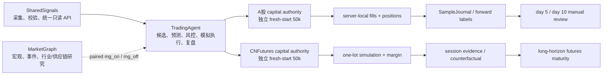
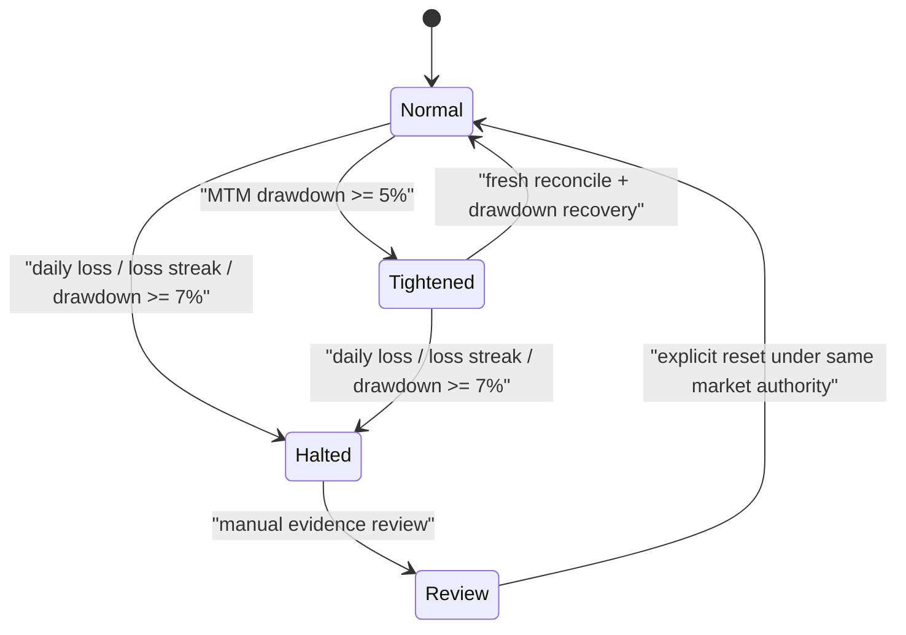
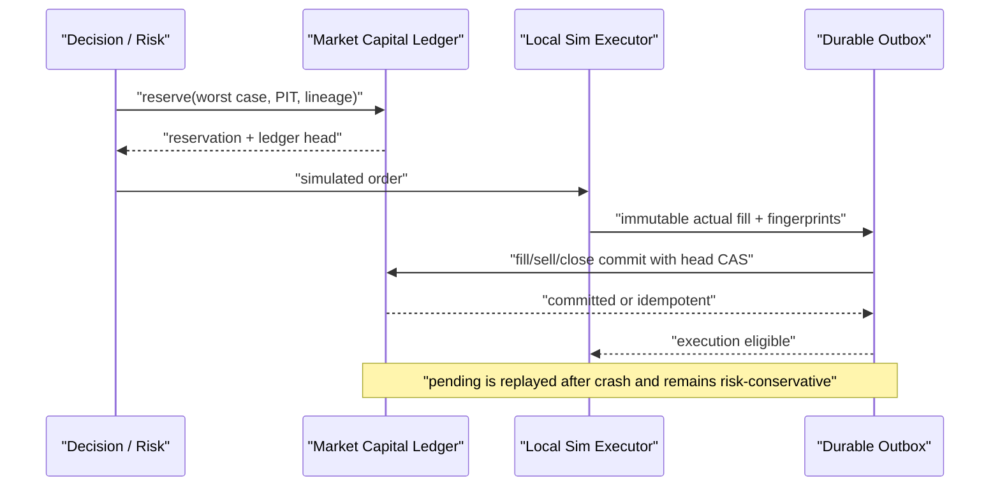

# TradingAgent 架构

> 本文定义长期系统边界与当前 capital-growth 架构。当前完成度见 [STATUS.md](../STATUS.md)，字段见 [data_contract.md](data_contract.md)，运行和回滚见 [operations.md](operations.md)。

## 目标与非目标

TradingAgent 的短期目标是在 A股和国内期货形成“数据 → 预测 → 风控 → 真实规格模拟成交/拒绝 → 前向标签 → 费用后复盘”的可学习闭环，并用真实证据判断策略是否存在可重复正期望。

50,000 CNY 是每个市场的独立模拟资本约束，不是盈利承诺。首 1–2 周主要验证工程、数据和执行闭环；短期盈利、样本量或 maturity readiness 都不能自动切实盘。

当前非目标：真实券商/期货下单、自动邮件、同花顺自动点击、自动 champion 晋级、自动风险扩张、跨市场资金调拨。

## 三仓边界



- SharedSignals 是基础行情、事件、行业、交易日历与合约输入 authority。TradingAgent 生产只走 HTTP API，不直读兄弟仓 SQLite，也不现场调用数据提供商。
- MarketGraph 是可选只读增强，不是价格、账户、资本或执行 authority。缺 MG 时 `mg_off` 仍应形成基础闭环。
- TradingAgent 拥有候选生成、风格预测、组合决策、资本预约、模拟成交、风险拒绝、样本、标签、复盘和只读看板。
- `front/` 是唯一活跃前端；它不写资金、队列或订单。

### V1 契约与权限边界

- `sharedsignals.query_result.v1`：SharedSignals 的 provider-neutral 查询结果契约。当前仅是隔离工作树中的目标契约，未经生产 runtime 和真实数据新鲜度验证前，不得描述为生产可用，也不得回退到 Tushare 直连或兄弟仓 SQLite。
- `tradingagent.sharedsignals.integration-readiness.v1`：TradingAgent 侧的可复用接入验收回执。它只从显式、无密钥 manifest 读取冻结的 endpoint、catalog、dataset、schema、PIT 与角色要求，通过同一 `SharedSignalsV1Client` 对每个数据集执行同 `as_of` 的两次独立查询，并复用 `DataEvidenceGate` 与 research snapshot 验证状态、freshness、lineage、receipt、字段及逐行 PIT。任一分页游标会按 `pagination_contract_unfrozen` 阻断，不能由客户端擅自拼页。通过结果仍是 `non_authority`，不证明生产可用、真实交易可用或未来结果可复现。
- `tradingagent.universe_scope.v1`：A股第一阶段只允许沪深主板个股进入候选、组合和模拟订单；创业板、科创板的指数及行业聚合数据只允许作为市场环境证据，不能升级为可交易个股。两个 paper composition root 只接受精确、无实例可变状态且由冻结 manifest 内容寻址的 `CanonicalMainboardScopePolicy`；伪 duck type、callable 与 subclass 一律在组装阶段拒绝。
- `tradingagent.llm_evidence.v1`：LLM/DeepSeek 只生成固定Prompt、内容寻址且可重新验证的证据观察。source span 被包在明确的不可信数据边界，显式中英文及部分常见编码/同形混淆提示注入会在transport前阻断；artifact hash只证明内容完整性，外部来源authority仍必须由receipt和独立verifier复核。typed provider receipt分别绑定本地完整transport material、实际供应商outbound、原始HTTPS response hash或离线fixture response hash、操作元数据与标准化evidence hash；内部proof metadata不发送给供应商。成功且完整验证的证据可进入显式head-CAS的本地hash-chain journal，`.head`仅为本地完整性锚点，不是外部密封、tamper-proof authority或production durable sink。默认关闭的官方HTTPS transport已是本地隔离候选，但没有真实provider调用、认证readback或生产部署。它不能直接改变候选成员、预测分数、风险请求、目标仓位或订单。
- `tradingagent.small_account_plan_receipt.v1`：5万元可行池只给出cash+policy上界；决策阶段必须另以无默认实现的`AccountAuthorityVerifier`复核完整账户内容、position receipt/hash、现金、gross、T+1可卖量、价格时点和有效期，再生成不可变plan receipt。A股卖出还必须符合整手、仅卖出不足100股余额或全部退出之一；risk与订单逐项绑定其SHA。
- `tradingagent.thesis_risk_runtime_authority.v1`：小账户计划不能只靠“股票数量分散”。行业、投资论点、原材料、政策/事件、拥挤和模型家族六维必须来自显式人工复核policy，并以逐成员detached proof与完整exposure-set receipt覆盖当前持仓、所有open/increase pending预约及候选。运行时不得自签policy/proof、漏记pending、跨决策重置风险或让同一股票的candidate/position/pending改换group；day loop还会把重签plan里的每个group重新绑定权威receipt。只有新增/增加风险受cap阻断，经过验证的减仓/退出继续。任一嵌套proof自报可晋级即拒绝，不能由外层非晋级标记洗白；fixture authority固定不可晋级，不代表生产分类、真实pending book或实盘上限已验证。

上述契约的当前状态与旧路径退役条件分别由 `shared/governance/system_state_matrix.yaml` 和 `shared/governance/legacy_inventory.yaml` 管理。状态必须区分本地候选、仓库契约、生产 runtime 与真实业务动作，不能用单层通过替代整条链路验证。

### 本地候选纵向链（非生产）

```text
IntegrationReadinessProbe（显式 fixture/移交 manifest；非 authority）
  -> catalog + 同 as_of 双查询 + 语义一致性/PIT/内容回执
  -> 通过后才允许进入下方本地研究链的下一层人工验收
SharedSignalsV1Client（fixture transport）
  -> DataEvidenceGate
  -> immutable ResearchDataSnapshot
  -> content-addressed CoverageReceipt
  -> MarketContext / simulated-scope AccountTradable
  -> Phase 1.5 industry shadow slice（1 deep + 2 watch；无个股输出）
  -> OpportunityRadar + append-only OpportunityLedger（独立shadow分支）
  -> multi-horizon forecast research artifact（未校准；独立shadow分支）
  -> three-style shadow router（去重/冲突/abstain；独立shadow分支）
  -> SmallCapitalFeasible cash+policy upper bound
  -> current-selection-bound Champion score receipt + cash baseline
  -> authority-bound small-account plan
  -> Decision / DriftConstrainedRisk / simulated OMS stage ports
  -> reconcile
  -> Decision Ledger + labels + local report
  -> atomic local RunBundle publication
  -> front read-only Today panel
```

这条图中 Opportunity/forecast/router 是与资本链隔离的shadow支路，最终只汇入审计/反事实，不接入 Champion、SmallCapitalFeasible、risk或OMS；其模块存在不表示预测有效或概率可发布。IntegrationReadinessProbe 当前也只有 fixture manifest 与本地合同测试，尚未获得 SharedSignals 所有者移交的真实 endpoint、catalog、dataset、认证及分页冻结合同，因此不能证明已有 live SS 数据。整条链同样不表示已有券商权限、真实持仓/可卖数量、生产 scheduler 或真实模拟样本。`CoverageReceipt` 以 taxonomy、PIT membership、板块/行业 expected-vs-observed、双创环境对象、来源 generation/receipt/lineage 和内容 hash 证明本次环境覆盖，并要求无默认实现的外部 `CoverageAuthorityVerifier` 在构造与消费两处复验 denominator；调用方不能自报 `full_market`。Phase 1.5 行业薄切片还要求独立 `IndustryScoreAuthorityVerifier` 绑定评分方法、有效期、score/coverage receipts 与内容 hash，才动态选出 1 个深研行业和 2 个观察行业。两类真实 verifier 均未接入，因此当前只具备 fixture 合同，不能产生当前可交易symbol或仓位影响。

当前 `AccountTradable` 只是模拟scope历史类型名；SmallCapital快照的 `max_buyable_shares` 只是在`position_state_applied=false`下的cash+policy upper bound，不能直接成为订单量。Decision stage 强制注入独立账户verifier，proof逐项绑定capital generation、账户时点、完整持仓、mark、sellable数量、现金、gross、position receipt/hash与有效期；本地重算会检查这些输入与proof一致。canonical 候选另须提交内容寻址的 Champion score receipt，绑定当前人工选择 manifest、精确冻结 spec、symbol、PIT decision time、数值特征 namespace/快照及数据 receipt/vintage/lineage；调用方 raw rank、篡改 receipt、过期/非当前 Champion 或 fixture evidence 冒充 canonical authority 均 fail closed。fixture路径只证明输入与不可晋级proof/evidence一致；canonical-capital测试路径从同一simulated ledger head派生并复读账户状态，current generation/lineage轮换必须随snapshot传播。两条路径都不证明账户、持仓或可卖量来自真实broker。随后plan从唯一 A股 policy 重算100股整手、15%单票、90% gross、最多8仓、最低经济订单、无交易区、`cost_policy_id`、费用、现金和完整digest；未校准 rank 只决定候选排序，新仓目标金额采用与 rank 无关的固定最小经济 probe，并标注为 engineering simulation。估值价与保守预留价分开。卖出100股整数倍、一次性卖出不足100股余额和全部退出之外的数量被optimizer、day loop及模拟撮合三处拒绝，调用方不得自动取整或改写。Day loop还会独立复算佣金、过户费和卖出印花税，重新签名不能洗白错费用。

Canonical-capital 的 mark/quote freshness 另有硬边界：非空持仓 mark 与非空执行 snapshot 必须嵌入精确 `MarketEvidenceAuthority`。该对象把 dataset/catalog、source receipt ID/SHA、source lineage、calendar receipt、symbol/price/session、capital authority/generation、execution lineage 与完整时点链绑定；账户估值只接受运行日前一已验证交易会话的 15:00 close，调用方不能用一个较新的 `mark_observed_at` 洗白旧账户 evidence。模拟执行只接受当前 trade date 的受支持连续竞价 session，quote 的 `data_through` 到 effect time 最多 30 秒。当前唯一具体 authority/verifier 是不可继承且 `production_eligible=false` 的冻结 fixture 类型；其proof是本地内容完整性hash，不是外部签名、SharedSignals live receipt readback或交易所行情认证。

执行 composition 还必须显式注入无默认实现的 `TrustedExecutionClock`。本地唯一具体时钟是内容寻址、不可继承的 `NonProductionFixtureExecutionClock`；系统分别在 `sim_submit` 与 `capital_commit` 紧邻副作用前重新取时并复核quote，commit校验后、账务提交前再做一次drift/Champion authority重读。quote时间只代表市场证据，模拟fill/terminal采用submit副作用时间，所有时点保留原始微秒精度且commit不得早于submit。若两次检查之间quote变旧、进入错误会话、时钟倒退或跨交易日，坏reading仍写入审计字段，terminal停在最后合法submit，尚未提交的模拟结果被丢弃、预约释放且capital outbox/ledger不提交；回执绑定时钟identity、market session、available/data-through与检查时点。日循环与对账复用`execution_receipt_contract.py`中的同一session/30秒TTL及严格零成交失败语义，先重证`data_through <= available <= execution <= submit`、submit时quote仍在30秒内且execution session匹配声明，再按生产器的错误优先级复核唯一原因和精确terminal；对账端另行强制`quote <= submit <= fill/terminal <= commit <= reconcile`。崩溃重放会先内容校验pending outbox及完整receipt seed，但只有canonical ledger证明对应commit已存在并返回幂等结果时才补settlement；intent-before-commit仍经过最新risk/drift门。整批静态 preflight、每个副作用前动态 recheck、最终authority reread、已提交事实恢复、对账重验和 drift/Champion revalidation是不同门，不互相代替。当前没有生产时钟、生产市场证据verifier，也没有未来外部authority与capital commit的原子事务。

预约所有权同样是副作用前门。capital-backed risk wrapper拒绝任何已携带当前或legacy预约字段的输入；只有`open/increase`可生成预约证明，execution仍拒绝买单携带legacy别名，`reduce/exit`在risk与execution两层均禁止携带预约字段。买入零成交释放时会先以同一run/order/reference、reservation event、authority/generation、execution lineage、risk unit和lineage向canonical ledger重证预约身份，并把订单声明的cash/exposure与canonical完整剩余值逐项全等比较；卖单不会调用释放。首次release服从effect guard，精确event之后预约必须立即`terminal=true`且remaining cash/exposure/margin全零；同一reference重放只能恢复这个已存在的相同终态事实。释放后回执携带完整预约证明，对账按事件前缀重放精确release event ID、金额、原因与reference，并再次要求该事件当时已终态全额释放，非空字符串、部分release或后来另行补齐的最终状态都不能冒充本次释放事实。

`RunContext` 把 `decision_as_of` 与 `trade_date` 按 `Asia/Shanghai` 绑定，并将它纳入 run identity。两套本地 composition 不得混称为一条已上线链：`compose_paper_runtime`/fixture CLI 仅接受精确的数据化 `FrozenFixtureStagePort` 和fixture账户/proof，可执行但非authority；`compose_capital_backed_paper_runtime` 使用public capital/risk/execution/reconcile ports，从canonical simulated ledger、人工选择Champion、六维论点风险authority与持久drift authority组合测试，但当前没有CLI、scheduler或真实paper样本。两者都不接受任意 callable 通过自报旗标冒充“离线”。Risk和网络关闭simulation的每笔资本/执行副作用都必须重读最新drift与Champion authority；论点风险链另行复核policy/proof/exposure-set identity、每笔精确notional delta、同股票组连续性和最终exposure map。收紧时把剩余open/increase强制改为未成交，同时保留权威reduce/exit和必要reservation清理。无新增订单但存在明确阻断时，paper day结束为`completed_with_blocks`。这不证明未来live broker已关闭TOCTOU；真实外部副作用前必须另做同等authority检查。RunBundle store只使用显式本地root，以逐事件不可变文件、fsync和原子publish支持恢复；业务receipt不封存主机绝对Journal路径，reported stage只封存相对publisher root的稳定定位，使同输入跨输出根保持相同bundle内容地址。CLI顶层仍返回本机绝对artifact路径供运维读取。fixture CLI只能写仓外隔离artifact且永不晋级。

### 自动化与自我进化的权限分离

```text
可自动：生成候选 -> 离线评估 -> 影子运行 -> 漂移监控
          -> 隔离 / reduce-only / stop-new-risk / require-review

人工门禁：Challenger 晋级 -> Champion 替换 -> 扩风险
          -> 更改 scope -> 连接 live broker
```

自我进化是“自动生成、验证和收紧”，不是生产模型在线改参数或自行获得更大资金权限。`ValidationPlan` 已将标签期限、特征回看、purge/embargo、事件簇隔离、decision-cluster去重、试验预算、PBO/DSR、OOS重用和冻结OOS receipt纳入不可变hash；A股还强制无默认calendar verifier，detached proof绑定dataset/receipt、完整会话、verified time和预测前`frozen_at`。`close/1d/3d/5d` target只从该proof派生。SampleJournal与两个A股label/sample ops入口都要求调用方显式传入计划；CLI只从`--validation-plan-path`加载预先生成、内容寻址且包含detached proof的artifact，拒绝symlink、非canonical payload和hash漂移，不在运行时调用verifier或铸造proof。它能阻断调用方自授会话与明显错误实验声明，但fixture proof和本地artifact自校验不替代受信artifact registry、生产calendar、exit price/total-return truth、purged walk-forward、PBO/DSR计算或冻结结果artifact。

漂移数值产物不能自报 `lineage_verified`。`tradingagent.drift_metrics_artifact.v2` 必须另有 canonical detached verification receipt；本地 verifier 不接受调用方选择任意实现，而是固定 implementation trust root，重新读取并hash完整artifact/receipt，逐项复核 artifact/evidence SHA、Journal head、model manifest、标签/成本快照、窗口、horizon、regime、独立有效样本数和 source receipt 集合；任一不一致即 fail closed。该hash是本地完整性证明，不是数字签名，固定本地实现也不等于已接入外部独立重算服务。自动收紧receipt进入内容寻址store并形成持久latch，风险乘数和动作严重度都不能回退，健康重启不能自行清除或放宽。Decision Ledger 保存模拟成交、明确未成交、风险拒绝和观察决策，并绑定 run、input bundle、capital authority/generation、execution lineage 和 prediction cluster。该账本为 audit-only，不直接进入统计学习、概率校准或晋级样本。market-truth 标签只有在外部frozen authority与OOS registry都重新验证，并同时绑定决策前冻结计划、总回报定义、公司行动policy和覆盖完整horizon的adjustment truth后，才可供predictive validation使用；fixture/paper/shadow永不因时间成熟而成为发布证据。

### LLM 与量化模型分工

密钥变量名固定为`DEEPSEEK_API_KEY`，公开配置对象绝不读取其值，换成其它格式合法的环境变量名同样会被拒绝。任意模型映射只能通过显式`from_offline_fixture_mapping`构造，并带`fixture_only=true`，不能授权provider egress；`LLMRouter`原有的独立环境变量入口已经移除。HTTP transport只接受provider专用的validated router，不能复用fixture路由；环境中的network布尔值只有在调用方同时给出进程内显式授权时才可形成候选路由，不能单独开启网络。

- 产品角色 `flash_extract`（代码路由`bulk_extraction`）：批量公开文档抽取、实体/时点/事件分类和引用候选；当前可配置DeepSeek V4 Flash，但vendor ID不进入领域合同；
- 产品角色 `pro_thinking`（代码路由`slow_research`）：慢速对抗研究、矛盾检查、产业假设、事故复盘和模型卡审阅；当前可配置DeepSeek V4 Pro thinking，旧`deepseek-reasoner`别名不固化；
- 所有 LLM：仅生成 `tradingagent.llm_evidence.v1` 证据候选；Prompt必须来自固定版本registry，EvidenceArtifact必须绑定document hash、精确source span/hash、PIT published/available time、实体解析版本和验证状态，请求hash再绑定模型、模板、证据集、payload及cutoff；无权排名、设仓位、改风险、发订单或读取账户/私有策略 payload。

`shared/llm/deepseek_config.py`把base URL `https://api.deepseek.com`、`deepseek-v4-flash`与`deepseek-v4-pro`映射到`bulk_extraction`和`slow_research`逻辑角色；2026-07-16已从[DeepSeek官方快速入门](https://api-docs.deepseek.com/)和[模型说明](https://api-docs.deepseek.com/quick_start/pricing/)核对这些公开接口目标、JSON输出与thinking能力。默认Gateway仍从严格、无密钥、network-disabled配置构造，而不是从宽松模型字符串直接生成路由。官方文档核对不等于认证账户readback或真实canary；quota、限流、成本、数据留存和当前账户可用性均未验证。

`shared/llm/providers/deepseek_http.py`实现唯一允许的云端客户端候选：固定`POST https://api.deepseek.com/chat/completions`，使用系统CA和hostname verification，禁用环境代理，拒绝全部重定向，不自动重试或fallback，固定`stream=false`，并限制request/response字节数。响应只接受HTTP 200、未压缩`application/json`、严格UTF-8和单一assistant choice；重复key、NaN/Infinity、过深/过大JSON、tool call、模型不匹配或非`stop`结果均fail closed。凭据只能从显式绝对路径的同owner、regular、单链接、`0400/0600` raw-secret文件在最后边界读取；ambient `DEEPSEEK_API_KEY`不被transport读取。请求hash、source proof、Prompt注入检查和全树DLP必须在客户端创建socket与读取credential前完成；公开`send`和脱离Gateway的HTTP Adapter调用永远拒绝，内部wire path只接受Gateway完成全部验证后铸造、以进程内HMAC绑定body、request/source-proof/material/outbound hash与批准模型的egress capability。当前这些性质只由fake opener合同测试证明，没有真实网络调用。

密钥父路径通过目录descriptor逐级验证owner、非可写权限和无symlink；默认provider router同时带`network_authorized=false`。即使调用方手工注入已启用HTTP transport，Gateway也会在读密钥或网络副作用前拒绝；只有provider配置的显式network authority与transport自身的显式启用同时成立，才能进入发送边界。这里的identity seal与HMAC都是应用进程内的显式能力和完整性边界，不是隔离任意恶意Python代码的安全沙箱；系统不得加载不可信同进程插件，未来若引入第三方可执行扩展，必须另做进程隔离和外部授权。

DeepSeek adapter只接受精确的冻结离线响应fixture或上述精确HTTP transport；普通callable拒绝。两条路径对`bulk_extraction`构造thinking disabled与`max_tokens=4096`目标，对`slow_research`构造thinking enabled、`reasoning_effort=high`与`max_tokens=8192`目标。本地authority proof metadata通过独立`transport_material_sha256`进入typed receipt，不进入provider outbound；HTTPS receipt另绑定原始response bytes hash、endpoint/method/status/content-type、请求/响应字节、egress policy、attempt=1与`not_retried`。离线receipt使用固定transport ID/version/policy，不能宣称HTTPS身份。动态Prompt、未验证/未绑定source span、缺外部authority verifier、cutoff后的receipt、未知动态对象，以及provider输出中的credential-shaped字段/值均fail closed。source span负例门增加NFKC、零宽控制字符、HTML entity、URL编码、JSON/Markdown角色标签和一组常见同形字规范化，但仍不是所有语义型或编码型注入的完备证明。本地journal也不是外部可证明防篡改。真实provider调用、production durable receipt authority、冻结评测、延迟/成本和收益增量仍未验证。

第一阶段继续使用冻结、可解释的 4–8 特征 rank-score Champion 和现金基线。每份score receipt同时绑定当前人工选择manifest、artifact SHA、model ID/version、完整`FrozenChampionSpec`，以及显式登记在 `tradingagent.numeric_pit_features.v1` namespace 的数值 PIT 特征快照。特征proof继续绑定dataset、source authority receipt、known time、实现SHA、归一化版本和source type；future、LLM、过早或调用方自证的特征均拒绝。决策stage与每个模拟副作用前重新验证current selection和feature proof，不再用字段名关键词黑名单推断来源安全。rank 未经概率/收益校准，因此只用于排序；新仓维持与rank无关的固定probe sizing。后续 Challenger 先从 elastic-net logistic、ridge/Huber/quantile regression 一类低复杂度模型起步；样本和 PIT 足够后才影子评估浅层、单调约束的 LightGBM/XGBoost/CatBoost/EBM/GAM，survival/hazard 用于事件时间。GNN、Transformer、TFT/TCN 和强化学习不进入第一阶段。

### 当前科学性缺口

- 已实现可散列`ValidationPlan`、无默认calendar verifier/detached proof、外部计划artifact门、SampleJournal/ops贯穿、同一authority派生的A股forward targets与冻结OOS标签门；但当前只有fixture verifier，CLI加载器不重新验证外部authority且尚无受信artifact registry，生产calendar/真实market-truth、purged/nested walk-forward、PBO、Deflated Sharpe、多重试验和OOS重用审计artifact均未完成；
- 当前 rank score 无可发布概率校准器，不能用 Brier/Log Loss/ECE 装饰；
- 上游dataset必须保存首次可见`available_at`、release/revision ID、每次修订链与训练时可见vintage；只有`as_of`而没有历史revision/backfill证据，不能进入predictive validation；
- 历史证券主数据必须PIT覆盖上市/退市、板块迁移、ST/风险警示、停复牌与历史指数/行业成员；CoverageReceipt证明当期denominator，不单独证明已消除幸存者偏差；
- 行业 shadow 已绑定 PIT taxonomy/membership、评分方法/有效期、score/coverage authority proof，但当前只有 fixture verifier；产业暴露、事件 hazard、跨市场映射与多期限分布尚未进入 Champion；
- OpportunityRadar/Ledger、多期限forecast和三风格router已有本地shadow合同，但尚未完成真实机会覆盖率、pre-trigger capture、FDR、可成交性、quantile loss/coverage、Brier/Log Loss/ECE、按期限/状态删失处理、分组消融、abstain价值、费用后增量、尾部与相关性验证；合同通过不能冒充实证有效；
- DeepSeek provider transport已是默认关闭的`local_isolated_candidate`，但真实provider canary、认证readback、quota/成本/留存及服务器/生产激活未验证；live paper scheduler仍为`PLANNED_NOT_IMPLEMENTED`；
- 当前已在每次risk评估及网络关闭的模拟副作用前重读drift latch；未来长驻scheduler/live broker仍须在真实外部副作用前绑定同一最新authority，当前fixture不能替代该验收；
- mark/quote、Champion selection/feature、metrics与时钟已有本地完整性和TOCTOU门，但生产市场证据verifier、生产Champion/feature registry verifier、独立metrics重算authority和可信长驻时钟均未实现；
- 真实 SS V1 runtime/dataset IDs、市场样本、20交易日工程闭环、60–120交易日科学成熟度与 paper-to-live 转化均未验证。

### 兼容退役尚未完成

新 V1 client 不代表旧消费链整体已切换。前端 market pulse 本地候选已只使用严格
`GET /v1/catalog` + `POST /v1/query`，并以静态门禁止恢复旧端点或 SQLite fallback；但 A股
adapter/research/T+1/opening/closing、`shared/screening/*`、`shared/research/*`、
`shared/execution/auto_pipeline.py`、wrapper/runtime-test/review 工具仍有
`TradingagentDataReader`、专用端点或旧配置引用，CNFutures 也仍有明示 SQLite/旧 endpoint
兼容；但显式空`SHAREDSIGNALS_API_URL`必须在旧reader前fail closed，SQLite仅能在隔离诊断中以
`TRADINGAGENT_ALLOW_SHARED_SIGNALS_SQLITE=1`和已存在的诊断数据库同时明示启用。其余路径在同
`as_of` parity、消费者切换、运行时 no-fallback 负例、文档/环境/调度扫描
全部通过前，只能标记 `COMPATIBILITY_TIMEBOXED` 或 `RETIREMENT_PENDING_VERIFICATION`。
新链失败时 fail closed，不回退旧链。

仓库现役cron模板已移除显式旧A股调度；仍保留的`job_ashare_*` wrapper以及
`job_market_capital_reconcile.sh ashare`分支只用于历史安装依赖识别，并在进入旧reader、
旧研究或旧执行前统一调用不可由环境变量恢复的`block_retired_ashare_runtime`，以退出码78
fail closed。重新启用必须是新的代码审查与cutover变更，不能改环境变量绕过。生产已安装
cron本轮未读取，因此仍不能宣称服务器旧任务已经移除。

## 双市场独立资本

| 市场 | authority | 初始权益 | 容量 | 说明 |
|---|---|---:|---:|---|
| A股 | `ashare-capital-v1` | 50,000 CNY | 股票 gross 45,000；单票 7,500 | 买入100股整数倍；卖出含完整零股/全退例外；组合容量8 |
| CNFutures | `cn-futures-capital-v1` | 50,000 CNY | 保证金 25,000 | 保证金与止损损失预算分开 |

历史 fresh-start 基线从 generation 1 开始，但消费者不得把 generation 或 execution lineage
写成常量。每次只接受 current capital snapshot 中验证通过的正整数 generation 与安全 lineage，
并要求所有下游回执逐项匹配。两个 authority 各自持有 cash、position/margin、reservation、
PnL、MTM equity、high-water、drawdown、loss streak、execution lineage 和 event chain；任何层
都不得相加、净额或补资。

账户不是“始终满仓”目标。A股全部50,000 CNY有资格服务合格机会，但动态运营现金、买入100股整数倍、费用/滑点、冻结订单、相关性、候选质量和风险门禁会造成未部署资金。资金计划必须显示利用率和未部署原因。现金管理建议与股票alpha分账且不自动下单。

历史共享资金、旧持仓/PnL 和旧多账本冻结只读，不继承到新 authority，也不进入 KPI、成熟度或前端货币汇总。

### A股当前持仓 authority

A股每轮 planning/risk/rebalance 在读取或解释任何 server-local、adapter、strategy 或 generic position snapshot 前，先从 current market capital ledger 建立单一、可重放的持仓 authority view。该 view 绑定 trade date、authority/generation、execution lineage、ledger checksum、规范化持仓、持仓数和持仓 fingerprint；checksum status、last checksum 和正整数 event count 也属于必需证据。缺持仓映射不能推断为零仓。`shared.accounting.position_ledger.get_positions` 的裸 `list` 没有 generation/checksum 归属，只能作为 legacy 诊断，禁止成为 A股 current risk source。

前端只读 snapshot 也遵守同一身份方向：从 verified current capital snapshot 派生
`shared/logs/execution_lineages/<execution_lineage_id>/simulated_ashare_positions.json`，不从目录名
反推 current authority。回执缺失（capital 声明非零持仓时）、损坏、身份或持仓数量冲突时，
只返回 unavailable/needs-attention，不读取固定日期 lineage，也不把 JSONL 路径按 SQLite 重开。

运行顺序固定为 capital authority A → 各 position source → capital authority B。A/B 的完整 state SHA 与 authority-view checksum 必须逐项相等；每个 position source 也必须以 source-owned canonical envelope 显式提供并匹配 authority ID、generation、execution lineage、authority checksum、trade date、position count 和 fingerprint。不得接受别名补齐，也不得读取后用 current capital state 给旧 snapshot 绑定 identity。来源缺字段、陈旧、非法、重复规范化股票代码、非法数量、声明冲突或并发读漂移时，统一 fail closed 为 `capital_position_source_mismatch`，同时保留所有来源 hash/lineage 审计。

通过门禁后，新增风险的 cash availability 也只取 market capital authority 的 `cash_balance_cny` 与 `available_to_reserve_cny` 保守较小值；adapter、server-local 或 strategy 自报 cash 只作诊断，不能铸造额外容量。current authority A 必须在读取本地交易事实前传给 `local_sim_ledger`；producer 自己重放 snapshot/PnL、验证二者一致并计算 source count/fingerprint/envelope，orchestrator 与 adapter 只能透传，不能在读取后补 identity。未带 current envelope 的磁盘 reporting snapshot 保持 unverified，不能进入普通 risk。

position authority validity 与 new-risk eligibility 是两个独立维度。`run_gate_review`、sim 和 shadow 先完成严格资本结构校验与 capital A → sources → B；日亏、连亏或 7% 回撤只令 verified view 输出 `new_risk_allowed=false` 和具体 `new_risk_reason`，不得清空已验证 positions。buy/open/add 在普通风险和容量判断前按该 reason 阻断；sell/trim/exit 保留 source-owned `entry_date` 与 sellable evidence，继续接受 T+1、幂等、成交和 `ashare_sell_commit` 评估。只有 authority 缺失/陈旧/非法或任一 source mismatch 才清空 positions 并全阻断。模拟 `filled` 或 `partial` 只要改变持仓，post-execution capital-plan refresh 就必须重新执行 capital A → sources → B；它只能使用新验证 view 的 positions/count/fingerprint 和 authority cash，不能直接重读 adapter account 形成当前计划。

该门禁位于普通 risk check、仓位容量判断、动态 capital plan 和 rebalance 之前。authority 失败时不得读取 legacy/strategy 持仓继续推理，不得默认零持仓、放宽风险或生成“持仓数 8 已达上限”一类普通拒绝；new-risk pause 则允许动态计划和 rebalance 仅为已验证持仓计算 risk-reducing sells，replacement/new buys 容量固定为 0。observation 可继续。CNFutures 仍使用自身独立的资本与持仓合同，不经过此 A股门禁。

## 每市场风险状态机



- 5% 回撤只将新增风险预算乘 0.75，不等于禁止所有新仓。
- 7% 回撤、日亏 3% 或连续亏损 3 次暂停该市场新增风险。
- A股与 CNFutures 独立触发。退出风险降低型订单单独评估，但仍需要真实持仓、会话/T+1、幂等和成交证据。

## A股三风格 shadow router（非 V1 决策能力）

> 当前 V1 决策链只有一个冻结 rank-score Champion。`tradingagent_multistyle_router` 已是本地隔离的shadow合同，但没有资本、风险或执行authority；旧四风格/exploration代码仍属time-boxed legacy，不得成为隐式fallback或当前能力证明。

同一PIT snapshot上的shadow sleeve固定为三类不同机制：

- `industry_trend`：产业供需、盈利兑现与中期趋势；
- `event_surprise`：事件生命周期、发生概率与预期差；
- `cross_market_dislocation`：外部冲击、真实暴露、传导滞后和A股已定价程度的错配。

每个sleeve只输出content-addressed evidence、shadow score/horizon/conflict与abstain语义。router先按evidence group去重，再记录primary/supporting、模型分歧和counterfactual candidate intent；它不设置target weight，也不拥有独立资本。

同一 snapshot 生成 paired MG on/off。`mg_off` 不能读取 MG 特征；两条 prediction 共享预测时点、基础数据、成本和标签口径，才能做有效消融。

Phase 3若要把shadow router接入统一50k候选路由，必须先完成组内去重、组间消融、不同regime与horizon的费用后独立增量、abstain价值、相关性与共同尾部检验，并经人工发布新合同。同一股票同日仍最多一份真实规格模拟订单；当前shadow receipt不产生订单。

## 历史三种样本意图（不进入 V1 当前路由）

- `observation`：所有数据合格候选均记录，不请求成交。成熟策略阈值和执行门禁不阻断 prediction。
- `exploration`：存在样本债且正常策略没有成交时，从硬门禁合格的 top-K 做分层随机/epsilon-greedy；记录 seed、selection method、probability/propensity。每日最多新增一个，累计探索敞口 7,500 CNY，日亏 225 CNY。
- `exploitation`：成熟策略按正常阈值、组合预算和风险运行。

Exploration 只下调策略评分、最小 edge 或研究完整度；数据、价格/成交证据、流动性、时段、T+1、整手、资金、幂等、累计敞口、日亏、连续亏损、回撤和实盘隔离永不放宽。

V1 当前只把 `PAPER_FILLED`、`PAPER_NOT_FILLED`、`REJECTED` 与 `OBSERVATION_ONLY` 写入 audit-only Decision Ledger，并由冻结 Champion、50k optimizer、drift constraint 与硬风控决定唯一模拟动作。未来重新引入多风格或探索时，必须先成为新版本的 shadow Challenger，完成独立验证后由人工批准；不能复用本节旧实现直接恢复。

## CNFutures：预测与可执行性分层

每个有效会话至少生成 prediction/candidate/hold/risk reject/simulated fill 之一。原始 heuristic score 和 uncalibrated prior 不得描述成已校准概率。

- 若真实一手、multiplier/tick、可追溯保证金、手续费、价格限制、滑点、夜盘跳空、会话、换月、持仓和独立风险预算全部适配，才可 execution-eligible simulated fill。
- 任一条件不适配则 `quantity=0`、`counterfactual_only=true`，方向预测、拒绝原因和标签继续。
- 保证金 25,000 CNY 是账户容量，不是单笔可承受亏损；止损损失预算另行约束。
- 静态合约规格只作 bootstrap，不代表交易所级撮合、保证金或强平精度。

期货成熟度以有效样本、完整回合、品种/波动/会话、夜盘、换月、极端风险、费用后结果、回撤和稳定性决定；不绑定 A股第几天，也没有实盘日期。

## 原子成交与 crash replay



- A股买入/期货开仓用 `fill_commit`；A股卖出用 `ashare_sell_commit`；期货平/减仓用 `position_close_commit`。
- commit 使用 actual quantity/price/fee/slippage/margin/PnL、PIT、receipt/local fact SHA、fill sequence 和 expected ledger event/checksum。
- A股 T+1 可卖量由同一 append-only capital ledger 的买入/卖出事件按 Asia/Shanghai 成交日 FIFO 重放，并与 position quantity 投影交叉校验；异常时间或数量不一致阻断卖出 commit。
- partial 只消费实际部分，终态原子释放未使用预约。pending commit 保守占用风险，不能用旧 reservation 或请求值伪造结算。
- 每日 MTM reconcile 用 exact reservation manifest、未结 commit IDs、持仓数量/成本/保证金、冻结额和 execution lineage 证明守恒。

## 样本、标签和演化

A股 `SampleJournal` 是唯一演化事实源，样本分层为 observation/counterfactual、exploration fill、exploitation fill、completed round trip、exit/stop、risk reject、chain validation。KPI、evolution decision 和 maturity 是可重建投影。

每轮 sample ops 只解析 Journal 一次，以 evidence availability/receipt cutoff 形成 frozen H0，并同时建立 prediction、label、cost 与 authority 索引。backlog 从 H0 计算 exact pending snapshot IDs，不允许因为一个 pending row 重扫同日所有 predictions；同一 symbol/date/run-as-of 的四 styles 与 MG on/off 共用行情证据缓存。provider timeout 或单票失败保留为 retryable pending/degraded，不生成伪 terminal，也不丢 observation。

label materialization 以 100–250 条为一批，在锁内校验 frozen 原始前缀后一次 append、一次 fsync。Journal 与 lock 的每次打开都要求 regular、single-link，且 FD 与 path device/inode 在临界区前后保持一致；hardlink 或协作锁内 path replacement 在写历史前 fail closed。只有本任务生成的稳定 event IDs 可以组成 task-owned delta H1；任何未知并发 append 都使本轮 fail closed，下一轮重新冻结。最后一批返回后还要对 physical H1 做最终 CAS，并持 Journal 共享锁穿过 current pointer 发布，避免未知 writer 落在校验与发布之间。KPI、decision 和 maturity 从同一 H1 内存视图构建，并共享一个 `projection_input_sha256`。

三份投影先写入内容寻址 generation，再以单一原子 `projection_current.json` 指针发布。pointer 封存 generation manifest content SHA；canonical reader 与 publisher 的 existing-generation 分支共享完整目录 validator，要求 exact manifest+三投影、regular/no-symlink/no-hardlink、raw hash/JSON/input lineage/sim-only 全部一致，并重算 generation ID。publisher 以 review-root 独占协作锁覆盖 generation 创建/复用、mirror/log、最终验证与 pointer swap；完整 generation 在可见前封存为目录/文件只读，validator 从 single-link file descriptors 读取并确认 inode 在读取期间未替换。最终 generation validation 同时冻结目录及 manifest + 三投影的 path、device/inode、nlink、mode、size、mtime/ctime nanoseconds 与 content SHA-256；pointer pre-`os.replace` callback 重新读取后必须与该次 final validation 身份逐项相等，同字节、同 mode 但不同 inode 的路径替换也必须拒绝。六份本轮 compatibility mirrors/logs 在写完后同样各自冻结完整身份快照。pointer 临时文件 fsync 后，只有 generation 及全部六份 compatibility identities 都通过同一锁内复验才允许切换 current。不完整、可写、碰撞、重命名/符号链接/硬链接替换或验证后突变都不能改变旧 current。发布中断时 current 仍指向上一完整 generation；generation 已存在而 current 缺失/非法时 fail closed。旧 `*_latest.json`/log 仅是兼容镜像，不是健康检查或前端事务点；仅明确无 generation 的 legacy 健康读取可以 degraded 呈现，必须把 maturity 降为 `legacy_degraded` 且 promotion evidence false。历史污染通过 append-only invalid/superseded audit 标记，不修改 Journal、ledger 或旧 generation。

上述锁是项目内授权 writer 的协作协议，不是对同 UID 恶意或失控进程的内核隔离。所有授权 SampleJournal/projection writer 必须先取得同一锁，并禁止直接改写已发布 generation、compatibility mirror 或 log；在最后一次用户态验证返回后、内核执行 pointer rename 前，无视锁的同 UID 进程仍可构成 P1 OS 隔离窗口。生产启用前必须完成所有 writer inventory，并 read back 运行 UID/GID、路径 owner/mode/ACL、mount 与 filesystem 语义；不能证明 writer 全部遵守锁或不能隔离非协作写入时，sample-ops cron 保持禁用。

本轮 P0 不包含 SharedSignals batch API、请求并发、持久化 sidecar index 或增量 KPI；这些仍是 P1，不能把本地 in-memory cache/index 描述成对应能力已经落地。

前向标签为 `m30/m60/close/1d/3d/5d`。A股`close/1d/3d/5d`目标由预测前冻结且经独立verifier复核的同一交易会话proof派生；调用方target只能断言相等，缺目标会话15:00日线不得顺延，label与结果绑定plan/calendar/proof SHA。该target authority只证明时点，不证明价格或收益真值。标签以 PIT `as_of` 限制可见数据；provider/bar/reference 先形成保留全部原始 event 与 receipt alias 的 EvidenceEnvelope，逐行用真实 prediction/decision boundary 校验 event 同一 UTC instant、所有 receipt 合法有时区、最晚 evidence receipt 不晚于边界。跨 stage 顺序使用所有 alias 的上下界，而不是只比较各组最大值；embedded structure error 在重复 canonicalization 中不可逆传播。invalid/future sibling 在价格选择前排除，只保留独立 rejection audit；有效行再按 validated canonical event instant 选择，与 provider 输入顺序无关。没有有效行时 reference price 保持空、snapshot pending/degraded、exploration 不得 selected。reference/entry 和 exit candidate 的窗口、排序、`evidence_at` 与 lineage 均只使用 validated canonical instant。真实 round trip 只有在同一 frozen Journal view 中唯一关联当前 authority prediction、entry fill 和全部 exit stop 后才供 maturity 与 actual-cost 使用；prediction append 保存 canonical source payload，validator从权威frozen event重算其source SHA与prediction canonical content，再重算fill/stop的canonical receipt/local-trade payload digests和由这些digest组成的round-trip source/content SHA。所有SHA通过constant-time内容绑定；多腿exit数组按identity顺序等长、逐元素验证，不能把任意64-hex、自报lineage或wrapper hash当作内容证据。历史prediction缺source payload、关联对象、完整数值或PIT EvidenceEnvelope任一不一致时保留审计并回退版本化保守成本，不得反向补造。进入predictive release的market-truth还必须绑定决策前冻结的OOS plan receipt、total-return definition、corporate-action policy与adjustment-truth receipt/hash/覆盖时点，并由注入的registry verifier在投影重建时复核。5分钟重复样本聚类去重，缺lineage/cost/fill/OOS/total-return revalidation的记录不进入晋级证据。

CNFutures 与 A股使用同一 EvidenceEnvelope 合同。SharedSignals HTTP client 在实际 response bytes 收到时保存独立 transport receipt；provider envelope/group 已非法时仍原样保留，并以 sibling `sharedsignals_response_lineage` 审计本次 HTTP，不允许 transport receipt 洗白 provider lineage。CNFutures prediction snapshot、session review row 与 `_price_evidence` 必须逐层保留 provider 的全部 event/receipt aliases、structure errors 和 nested PIT。只允许在统一验证成功后生成 canonical 四钟；历史 prediction 或 raw bar 没有真实 receipt 时继续 pending/degraded，不能用 bar time、prediction/as-of 或 wall clock 补造 provider receipt。

A股第 5、10 个交易日只触发人工复核状态；SampleJournal/KPI 只能评估 evidence readiness。`automatic_promotion_enabled=false`、`automatic_risk_expansion_enabled=false`、`live_transition_authorized=false`。

未来 A股人工实盘若获 Nicholas 单独批准，账户仍是完整 50,000 CNY，但初始订单敞口仅 20%–30%。拟议“TA 信号 → 邮件 → Nicholas 在同花顺人工下单”未实现；未来 broker automation gateway 也必须独立设计和验收。

## 前端边界

- All Markets 可汇总市场数、信号数、持仓数和健康状态等非货币计数。
- 资本、权益、PnL、收益率、回撤和资金利用率必须按市场单独显示；A股和 CNFutures 不能合成跨市场组合或互相抵消风险。
- authority/generation/maturity 缺失时显示 unavailable/null，不在前端推断。
- 前端只读，不创建订单、预约、标签、邮件或回调。
- 系统仅供 Nicholas 个人内部使用；前端与只读 API 只允许绑定loopback，服务启动时拒绝`0.0.0.0`等非loopback地址与`*` CORS。`tradingagent.cc`可作为远程入口，但必须先经过Cloudflare Access或等价单用户认证；API不得直接公网暴露。域名、Tunnel/Pages、认证策略、日志与撤销路径必须逐层验证。
