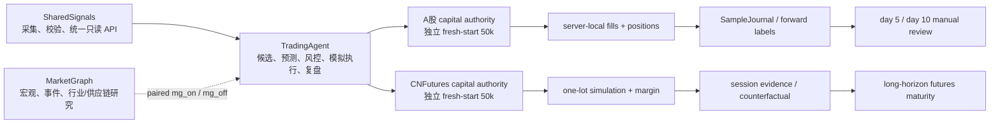
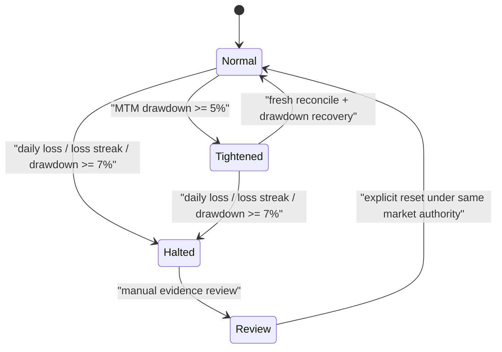
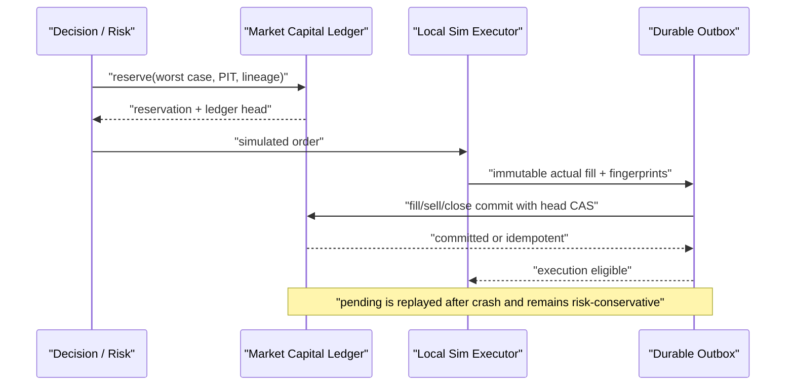

# TradingAgent 架构

> 本文定义长期系统边界与当前 capital-growth 架构。当前完成度见 [STATUS.md](../STATUS.md)，字段见 [data_contract.md](data_contract.md)，运行和回滚见 [operations.md](operations.md)。

## 目标与非目标

TradingAgent 的短期目标是在 A股和国内期货形成“数据 → 预测 → 风控 → 真实规格模拟成交/拒绝 → 前向标签 → 费用后复盘”的可学习闭环，并用真实证据判断策略是否存在可重复正期望。

50,000 CNY 是每个市场的独立模拟资本约束，不是盈利承诺。首 1–2 周主要验证工程、数据和执行闭环；短期盈利、样本量或 maturity readiness 都不能自动切实盘。

当前非目标：真实券商/期货下单、自动邮件、同花顺自动点击、自动 champion 晋级、自动风险扩张、跨市场资金调拨。

## 三仓边界

- SharedSignals 是基础行情、事件、行业、交易日历与合约输入 authority。TradingAgent 生产只走 HTTP API，不直读兄弟仓 SQLite，也不现场调用数据提供商。
- MarketGraph 是可选只读增强，不是价格、账户、资本或执行 authority。缺 MG 时 `mg_off` 仍应形成基础闭环。
- TradingAgent 拥有候选生成、风格预测、组合决策、资本预约、模拟成交、风险拒绝、样本、标签、复盘和只读看板。
- `front/` 是唯一活跃前端；它不写资金、队列或订单。

## 双市场独立资本

| 市场 | authority | 初始权益 | 容量 | 说明 |
|---|---|---:|---:|---|
| A股 | `ashare-capital-v1` | 50,000 CNY | 股票 gross 45,000；单票 7,500 | 100 股整手；组合容量 8 |
| CNFutures | `cn-futures-capital-v1` | 50,000 CNY | 保证金 25,000 | 保证金与止损损失预算分开 |

两个 authority 都是 generation 1 的 fresh start。它们各自持有 cash、position/margin、reservation、PnL、MTM equity、high-water、drawdown、loss streak、execution lineage 和 event chain；任何层都不得相加、净额或补资。

账户不是“始终满仓”目标。A股全部 50,000 CNY 有资格服务合格机会，但动态运营现金、100 股整手、费用/滑点、冻结订单、相关性、候选质量和风险门禁会造成未部署资金。资金计划必须显示利用率和未部署原因。现金管理建议与股票 alpha 分账且不自动下单。

历史共享资金、旧持仓/PnL 和旧多账本冻结只读，不继承到新 authority，也不进入 KPI、成熟度或前端货币汇总。

## 每市场风险状态机

- 5% 回撤只将新增风险预算乘 0.75，不等于禁止所有新仓。
- 7% 回撤、日亏 3% 或连续亏损 3 次暂停该市场新增风险。
- A股与 CNFutures 独立触发。退出风险降低型订单单独评估，但仍需要真实持仓、会话/T+1、幂等和成交证据。

## A股：共享候选、多风格、单账户

每个数据合格候选基于同一 immutable base snapshot 形成四类正交假设：

- `trend_breakout_strength_continuation`
- `pullback_or_short_reversal`
- `event_catalyst_with_price_confirmation`
- `defensive_low_volatility_abstain`

每个风格独立输出 direction、raw ranking score、uncalibrated prior、entry/exit thesis、holding horizon、expected-return prior、risk request 和 abstain/reject reason。它们没有独立资本。

同一 snapshot 生成 paired MG on/off。`mg_off` 不能读取 MG 特征；两条 prediction 共享预测时点、基础数据、成本和标签口径，才能做有效消融。

一个组合决策器处理风格冲突、相关性、资金和幂等；同一股票同日最多产生一份真实规格模拟订单。成交保存 primary/supporting styles、style scores/versions、decision policy、disagreement 和 sample intent。未被选中的风格仍生成标签，避免选择偏差。

## 三种样本意图

- `observation`：所有数据合格候选均记录，不请求成交。成熟策略阈值和执行门禁不阻断 prediction。
- `exploration`：存在样本债且正常策略没有成交时，从硬门禁合格的 top-K 做分层随机/epsilon-greedy；记录 seed、selection method、probability/propensity。每日最多新增一个，累计探索敞口 7,500 CNY，日亏 225 CNY。
- `exploitation`：成熟策略按正常阈值、组合预算和风险运行。

Exploration 只下调策略评分、最小 edge 或研究完整度；数据、价格/成交证据、流动性、时段、T+1、整手、资金、幂等、累计敞口、日亏、连续亏损、回撤和实盘隔离永不放宽。

## CNFutures：预测与可执行性分层

每个有效会话至少生成 prediction/candidate/hold/risk reject/simulated fill 之一。原始 heuristic score 和 uncalibrated prior 不得描述成已校准概率。

- 若真实一手、multiplier/tick、可追溯保证金、手续费、价格限制、滑点、夜盘跳空、会话、换月、持仓和独立风险预算全部适配，才可 execution-eligible simulated fill。
- 任一条件不适配则 `quantity=0`、`counterfactual_only=true`，方向预测、拒绝原因和标签继续。
- 保证金 25,000 CNY 是账户容量，不是单笔可承受亏损；止损损失预算另行约束。
- 静态合约规格只作 bootstrap，不代表交易所级撮合、保证金或强平精度。

期货成熟度以有效样本、完整回合、品种/波动/会话、夜盘、换月、极端风险、费用后结果、回撤和稳定性决定；不绑定 A股第几天，也没有实盘日期。

## 原子成交与 crash replay

- A股买入/期货开仓用 `fill_commit`；A股卖出用 `ashare_sell_commit`；期货平/减仓用 `position_close_commit`。
- commit 使用 actual quantity/price/fee/slippage/margin/PnL、PIT、receipt/local fact SHA、fill sequence 和 expected ledger event/checksum。
- partial 只消费实际部分，终态原子释放未使用预约。pending commit 保守占用风险，不能用旧 reservation 或请求值伪造结算。
- 每日 MTM reconcile 用 exact reservation manifest、未结 commit IDs、持仓数量/成本/保证金、冻结额和 execution lineage 证明守恒。

## 样本、标签和演化

A股 `SampleJournal` 是唯一演化事实源，样本分层为 observation/counterfactual、exploration fill、exploitation fill、completed round trip、exit/stop、risk reject、chain validation。KPI、evolution decision 和 maturity 是可重建投影。

前向标签为 `m30/m60/close/1d/3d/5d`。标签以 PIT `as_of` 限制可见数据；真实 round trip 使用实际费用/滑点，反事实使用版本化保守成本。5 分钟重复样本聚类去重，缺 lineage/cost/fill revalidation 的记录不进入晋级证据。

A股第 5、10 个交易日只触发人工复核状态；SampleJournal/KPI 只能评估 evidence readiness。`automatic_promotion_enabled=false`、`automatic_risk_expansion_enabled=false`、`live_transition_authorized=false`。

未来 A股人工实盘若获 Nicholas 单独批准，账户仍是完整 50,000 CNY，但初始订单敞口仅 20%–30%。拟议“TA 信号 → 邮件 → Nicholas 在同花顺人工下单”未实现；未来 broker automation gateway 也必须独立设计和验收。

## 前端边界

- All Markets 可汇总市场数、信号数、持仓数和健康状态等非货币计数。
- 资本、权益、PnL、收益率、回撤和资金利用率必须按市场单独显示；A股和 CNFutures 不能合成跨市场组合或互相抵消风险。
- authority/generation/maturity 缺失时显示 unavailable/null，不在前端推断。
- 前端只读，不创建订单、预约、标签、邮件或回调。
