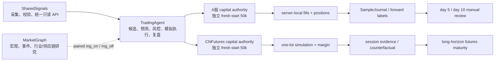
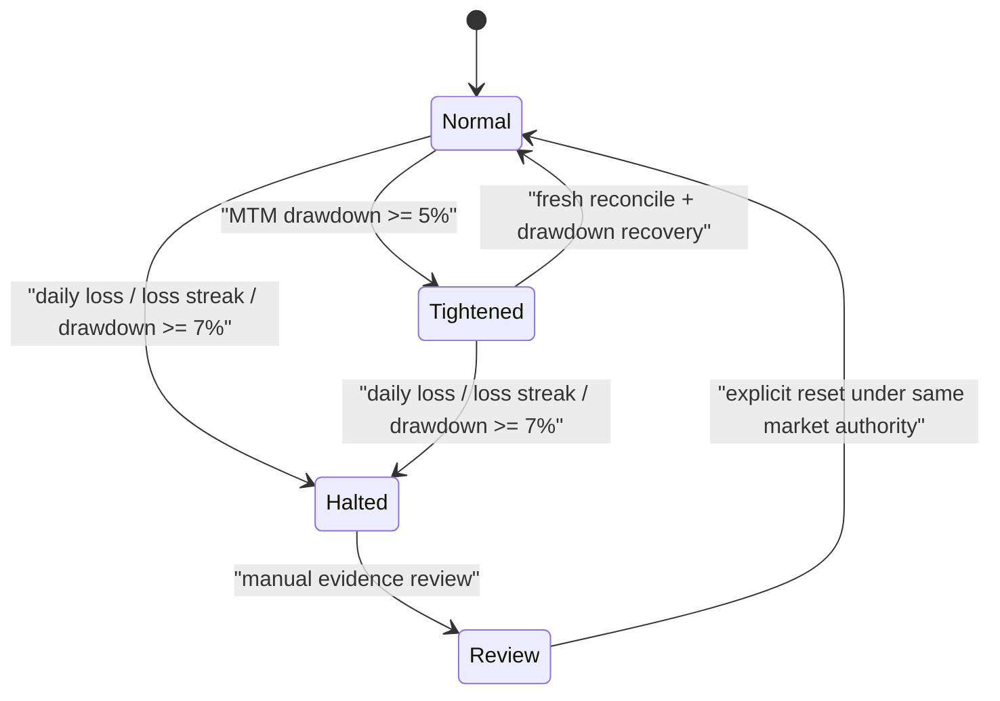
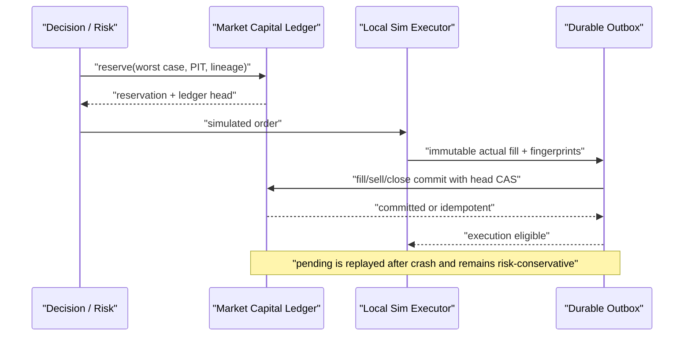

# TradingAgent 架构

> 本文定义长期系统边界与当前 capital-growth 架构。当前完成度见 [STATUS.md](../STATUS.md)，字段见 [data_contract.md](data_contract.md)，运行和回滚见 [operations.md](operations.md)。

## 目标与非目标

TradingAgent 的短期目标是在 A股和国内期货形成“数据 → 预测 → 风控 → 真实规格模拟成交/拒绝 → 前向标签 → 费用后复盘”的可学习闭环，并用真实证据判断策略是否存在可重复正期望。

50,000 CNY 是每个市场的独立模拟资本约束，不是盈利承诺。首 1–2 周主要验证工程、数据和执行闭环；短期盈利、样本量或 maturity readiness 都不能自动切实盘。

当前非目标：真实券商/期货下单、自动邮件、同花顺自动点击、自动 champion 晋级、自动风险扩张、跨市场资金调拨。

## 三仓边界

- SharedSignals 是基础行情、事件、行业、交易日历与合约输入 authority。TradingAgent 生产只走 HTTP API，不直读兄弟仓 SQLite，也不现场调用数据提供商。
- MarketGraph 是可选只读增强，不是价格、账户、资本或执行 authority。缺 MG 时 `mg_off` 仍应形成基础闭环。
- TradingAgent 拥有候选生成、风格预测、组合决策、资本预约、模拟成交、风险拒绝、样本、标签、复盘和只读看板。
- `front/` 是唯一活跃前端；它不写资金、队列或订单。

## 双市场独立资本

| 市场 | authority | 初始权益 | 容量 | 说明 |
|---|---|---:|---:|---|
| A股 | `ashare-capital-v1` | 50,000 CNY | 股票 gross 45,000；单票 7,500 | 100 股整手；组合容量 8 |
| CNFutures | `cn-futures-capital-v1` | 50,000 CNY | 保证金 25,000 | 保证金与止损损失预算分开 |

两个 authority 都是 generation 1 的 fresh start。它们各自持有 cash、position/margin、reservation、PnL、MTM equity、high-water、drawdown、loss streak、execution lineage 和 event chain；任何层都不得相加、净额或补资。

账户不是“始终满仓”目标。A股全部 50,000 CNY 有资格服务合格机会，但动态运营现金、100 股整手、费用/滑点、冻结订单、相关性、候选质量和风险门禁会造成未部署资金。资金计划必须显示利用率和未部署原因。现金管理建议与股票 alpha 分账且不自动下单。

历史共享资金、旧持仓/PnL 和旧多账本冻结只读，不继承到新 authority，也不进入 KPI、成熟度或前端货币汇总。

### A股当前持仓 authority

A股每轮 planning/risk/rebalance 在读取或解释任何 server-local、adapter、strategy 或 generic position snapshot 前，先从 current market capital ledger 建立单一、可重放的持仓 authority view。该 view 绑定 trade date、authority/generation、execution lineage、ledger checksum、规范化持仓、持仓数和持仓 fingerprint；checksum status、last checksum 和正整数 event count 也属于必需证据。缺持仓映射不能推断为零仓。`shared.accounting.position_ledger.get_positions` 的裸 `list` 没有 generation/checksum 归属，只能作为 legacy 诊断，禁止成为 A股 current risk source。

运行顺序固定为 capital authority A → 各 position source → capital authority B。A/B 的完整 state SHA 与 authority-view checksum 必须逐项相等；每个 position source 也必须以 source-owned canonical envelope 显式提供并匹配 authority ID、generation、execution lineage、authority checksum、trade date、position count 和 fingerprint。不得接受别名补齐，也不得读取后用 current capital state 给旧 snapshot 绑定 identity。来源缺字段、陈旧、非法、重复规范化股票代码、非法数量、声明冲突或并发读漂移时，统一 fail closed 为 `capital_position_source_mismatch`，同时保留所有来源 hash/lineage 审计。

通过门禁后，新增风险的 cash availability 也只取 market capital authority 的 `cash_balance_cny` 与 `available_to_reserve_cny` 保守较小值；adapter、server-local 或 strategy 自报 cash 只作诊断，不能铸造额外容量。current authority A 必须在读取本地交易事实前传给 `local_sim_ledger`；producer 自己重放 snapshot/PnL、验证二者一致并计算 source count/fingerprint/envelope，orchestrator 与 adapter 只能透传，不能在读取后补 identity。未带 current envelope 的磁盘 reporting snapshot 保持 unverified，不能进入普通 risk。

position authority validity 与 new-risk eligibility 是两个独立维度。`run_gate_review`、sim 和 shadow 先完成严格资本结构校验与 capital A → sources → B；日亏、连亏或 7% 回撤只令 verified view 输出 `new_risk_allowed=false` 和具体 `new_risk_reason`，不得清空已验证 positions。buy/open/add 在普通风险和容量判断前按该 reason 阻断；sell/trim/exit 保留 source-owned `entry_date` 与 sellable evidence，继续接受 T+1、幂等、成交和 `ashare_sell_commit` 评估。只有 authority 缺失/陈旧/非法或任一 source mismatch 才清空 positions 并全阻断。模拟 `filled` 或 `partial` 只要改变持仓，post-execution capital-plan refresh 就必须重新执行 capital A → sources → B；它只能使用新验证 view 的 positions/count/fingerprint 和 authority cash，不能直接重读 adapter account 形成当前计划。

该门禁位于普通 risk check、仓位容量判断、动态 capital plan 和 rebalance 之前。authority 失败时不得读取 legacy/strategy 持仓继续推理，不得默认零持仓、放宽风险或生成“持仓数 8 已达上限”一类普通拒绝；new-risk pause 则允许动态计划和 rebalance 仅为已验证持仓计算 risk-reducing sells，replacement/new buys 容量固定为 0。observation 可继续。CNFutures 仍使用自身独立的资本与持仓合同，不经过此 A股门禁。

## 每市场风险状态机

- 5% 回撤只将新增风险预算乘 0.75，不等于禁止所有新仓。
- 7% 回撤、日亏 3% 或连续亏损 3 次暂停该市场新增风险。
- A股与 CNFutures 独立触发。退出风险降低型订单单独评估，但仍需要真实持仓、会话/T+1、幂等和成交证据。

## A股：共享候选、多风格、单账户

每个数据合格候选基于同一 immutable base snapshot 形成四类正交假设：

- `trend_breakout_strength_continuation`
- `pullback_or_short_reversal`
- `event_catalyst_with_price_confirmation`
- `defensive_low_volatility_abstain`

每个风格独立输出 direction、raw ranking score、uncalibrated prior、entry/exit thesis、holding horizon、expected-return prior、risk request 和 abstain/reject reason。它们没有独立资本。

同一 snapshot 生成 paired MG on/off。`mg_off` 不能读取 MG 特征；两条 prediction 共享预测时点、基础数据、成本和标签口径，才能做有效消融。

一个组合决策器处理风格冲突、相关性、资金和幂等；同一股票同日最多产生一份真实规格模拟订单。成交保存 primary/supporting styles、style scores/versions、decision policy、disagreement 和 sample intent。未被选中的风格仍生成标签，避免选择偏差。

## 三种样本意图

- `observation`：所有数据合格候选均记录，不请求成交。成熟策略阈值和执行门禁不阻断 prediction。
- `exploration`：存在样本债且正常策略没有成交时，从硬门禁合格的 top-K 做分层随机/epsilon-greedy；记录 seed、selection method、probability/propensity。每日最多新增一个，累计探索敞口 7,500 CNY，日亏 225 CNY。
- `exploitation`：成熟策略按正常阈值、组合预算和风险运行。

Exploration 只下调策略评分、最小 edge 或研究完整度；数据、价格/成交证据、流动性、时段、T+1、整手、资金、幂等、累计敞口、日亏、连续亏损、回撤和实盘隔离永不放宽。

## CNFutures：预测与可执行性分层

每个有效会话至少生成 prediction/candidate/hold/risk reject/simulated fill 之一。原始 heuristic score 和 uncalibrated prior 不得描述成已校准概率。

- 若真实一手、multiplier/tick、可追溯保证金、手续费、价格限制、滑点、夜盘跳空、会话、换月、持仓和独立风险预算全部适配，才可 execution-eligible simulated fill。
- 任一条件不适配则 `quantity=0`、`counterfactual_only=true`，方向预测、拒绝原因和标签继续。
- 保证金 25,000 CNY 是账户容量，不是单笔可承受亏损；止损损失预算另行约束。
- 静态合约规格只作 bootstrap，不代表交易所级撮合、保证金或强平精度。

期货成熟度以有效样本、完整回合、品种/波动/会话、夜盘、换月、极端风险、费用后结果、回撤和稳定性决定；不绑定 A股第几天，也没有实盘日期。

## 原子成交与 crash replay

- A股买入/期货开仓用 `fill_commit`；A股卖出用 `ashare_sell_commit`；期货平/减仓用 `position_close_commit`。
- commit 使用 actual quantity/price/fee/slippage/margin/PnL、PIT、receipt/local fact SHA、fill sequence 和 expected ledger event/checksum。
- partial 只消费实际部分，终态原子释放未使用预约。pending commit 保守占用风险，不能用旧 reservation 或请求值伪造结算。
- 每日 MTM reconcile 用 exact reservation manifest、未结 commit IDs、持仓数量/成本/保证金、冻结额和 execution lineage 证明守恒。

## 样本、标签和演化

A股 `SampleJournal` 是唯一演化事实源，样本分层为 observation/counterfactual、exploration fill、exploitation fill、completed round trip、exit/stop、risk reject、chain validation。KPI、evolution decision 和 maturity 是可重建投影。

每轮 sample ops 只解析 Journal 一次，以 evidence availability/receipt cutoff 形成 frozen H0，并同时建立 prediction、label、cost 与 authority 索引。backlog 从 H0 计算 exact pending snapshot IDs，不允许因为一个 pending row 重扫同日所有 predictions；同一 symbol/date/run-as-of 的四 styles 与 MG on/off 共用行情证据缓存。provider timeout 或单票失败保留为 retryable pending/degraded，不生成伪 terminal，也不丢 observation。

label materialization 以 100–250 条为一批，在锁内校验 frozen 原始前缀后一次 append、一次 fsync。Journal 与 lock 的每次打开都要求 regular、single-link，且 FD 与 path device/inode 在临界区前后保持一致；hardlink 或协作锁内 path replacement 在写历史前 fail closed。只有本任务生成的稳定 event IDs 可以组成 task-owned delta H1；任何未知并发 append 都使本轮 fail closed，下一轮重新冻结。最后一批返回后还要对 physical H1 做最终 CAS，并持 Journal 共享锁穿过 current pointer 发布，避免未知 writer 落在校验与发布之间。KPI、decision 和 maturity 从同一 H1 内存视图构建，并共享一个 `projection_input_sha256`。

三份投影先写入内容寻址 generation，再以单一原子 `projection_current.json` 指针发布。pointer 封存 generation manifest content SHA；canonical reader 与 publisher 的 existing-generation 分支共享完整目录 validator，要求 exact manifest+三投影、regular/no-symlink/no-hardlink、raw hash/JSON/input lineage/sim-only 全部一致，并重算 generation ID。publisher 以 review-root 独占协作锁覆盖 generation 创建/复用、mirror/log、最终验证与 pointer swap；完整 generation 在可见前封存为目录/文件只读，validator 从 single-link file descriptors 读取并确认 inode 在读取期间未替换。最终 generation validation 同时冻结目录及 manifest + 三投影的 path、device/inode、nlink、mode、size、mtime/ctime nanoseconds 与 content SHA-256；pointer pre-`os.replace` callback 重新读取后必须与该次 final validation 身份逐项相等，同字节、同 mode 但不同 inode 的路径替换也必须拒绝。六份本轮 compatibility mirrors/logs 在写完后同样各自冻结完整身份快照。pointer 临时文件 fsync 后，只有 generation 及全部六份 compatibility identities 都通过同一锁内复验才允许切换 current。不完整、可写、碰撞、重命名/符号链接/硬链接替换或验证后突变都不能改变旧 current。发布中断时 current 仍指向上一完整 generation；generation 已存在而 current 缺失/非法时 fail closed。旧 `*_latest.json`/log 仅是兼容镜像，不是健康检查或前端事务点；仅明确无 generation 的 legacy 健康读取可以 degraded 呈现，必须把 maturity 降为 `legacy_degraded` 且 promotion evidence false。历史污染通过 append-only invalid/superseded audit 标记，不修改 Journal、ledger 或旧 generation。

上述锁是项目内授权 writer 的协作协议，不是对同 UID 恶意或失控进程的内核隔离。所有授权 SampleJournal/projection writer 必须先取得同一锁，并禁止直接改写已发布 generation、compatibility mirror 或 log；在最后一次用户态验证返回后、内核执行 pointer rename 前，无视锁的同 UID 进程仍可构成 P1 OS 隔离窗口。生产启用前必须完成所有 writer inventory，并 read back 运行 UID/GID、路径 owner/mode/ACL、mount 与 filesystem 语义；不能证明 writer 全部遵守锁或不能隔离非协作写入时，sample-ops cron 保持禁用。

本轮 P0 不包含 SharedSignals batch API、请求并发、持久化 sidecar index 或增量 KPI；这些仍是 P1，不能把本地 in-memory cache/index 描述成对应能力已经落地。

前向标签为 `m30/m60/close/1d/3d/5d`。标签以 PIT `as_of` 限制可见数据；provider/bar/reference 先形成保留全部原始 event 与 receipt alias 的 EvidenceEnvelope，逐行用真实 prediction/decision boundary 校验 event 同一 UTC instant、所有 receipt 合法有时区、最晚 evidence receipt 不晚于边界。跨 stage 顺序使用所有 alias 的上下界，而不是只比较各组最大值；embedded structure error 在重复 canonicalization 中不可逆传播。invalid/future sibling 在价格选择前排除，只保留独立 rejection audit；有效行再按 validated canonical event instant 选择，与 provider 输入顺序无关。没有有效行时 reference price 保持空、snapshot pending/degraded、exploration 不得 selected。reference/entry 和 exit candidate 的窗口、排序、`evidence_at` 与 lineage 均只使用 validated canonical instant。真实 round trip 只有在同一 frozen Journal view 中唯一关联当前 authority prediction、entry fill 和全部 exit stop 后才供 maturity 与 actual-cost 使用；prediction append 保存 canonical source payload，validator 从权威 frozen event 重算其 source SHA 与 prediction canonical content，再重算 fill/stop 的 canonical receipt/local-trade payload digests 和由这些 digest 组成的 round-trip source/content SHA。所有 SHA 通过 constant-time 内容绑定；多腿 exit 数组按 identity 顺序等长、逐元素验证，不能把任意 64-hex、自报 lineage 或 wrapper hash 当作内容证据。历史 prediction 缺 source payload、关联对象、完整数值或 PIT EvidenceEnvelope 任一不一致时保留审计并回退版本化保守成本，不得反向补造。5 分钟重复样本聚类去重，缺 lineage/cost/fill revalidation 的记录不进入晋级证据。

CNFutures 与 A股使用同一 EvidenceEnvelope 合同。SharedSignals HTTP client 在实际 response bytes 收到时保存独立 transport receipt；provider envelope/group 已非法时仍原样保留，并以 sibling `sharedsignals_response_lineage` 审计本次 HTTP，不允许 transport receipt 洗白 provider lineage。CNFutures prediction snapshot、session review row 与 `_price_evidence` 必须逐层保留 provider 的全部 event/receipt aliases、structure errors 和 nested PIT。只允许在统一验证成功后生成 canonical 四钟；历史 prediction 或 raw bar 没有真实 receipt 时继续 pending/degraded，不能用 bar time、prediction/as-of 或 wall clock 补造 provider receipt。

A股第 5、10 个交易日只触发人工复核状态；SampleJournal/KPI 只能评估 evidence readiness。`automatic_promotion_enabled=false`、`automatic_risk_expansion_enabled=false`、`live_transition_authorized=false`。

未来 A股人工实盘若获 Nicholas 单独批准，账户仍是完整 50,000 CNY，但初始订单敞口仅 20%–30%。拟议“TA 信号 → 邮件 → Nicholas 在同花顺人工下单”未实现；未来 broker automation gateway 也必须独立设计和验收。

## 前端边界

- All Markets 可汇总市场数、信号数、持仓数和健康状态等非货币计数。
- 资本、权益、PnL、收益率、回撤和资金利用率必须按市场单独显示；A股和 CNFutures 不能合成跨市场组合或互相抵消风险。
- authority/generation/maturity 缺失时显示 unavailable/null，不在前端推断。
- 前端只读，不创建订单、预约、标签、邮件或回调。
